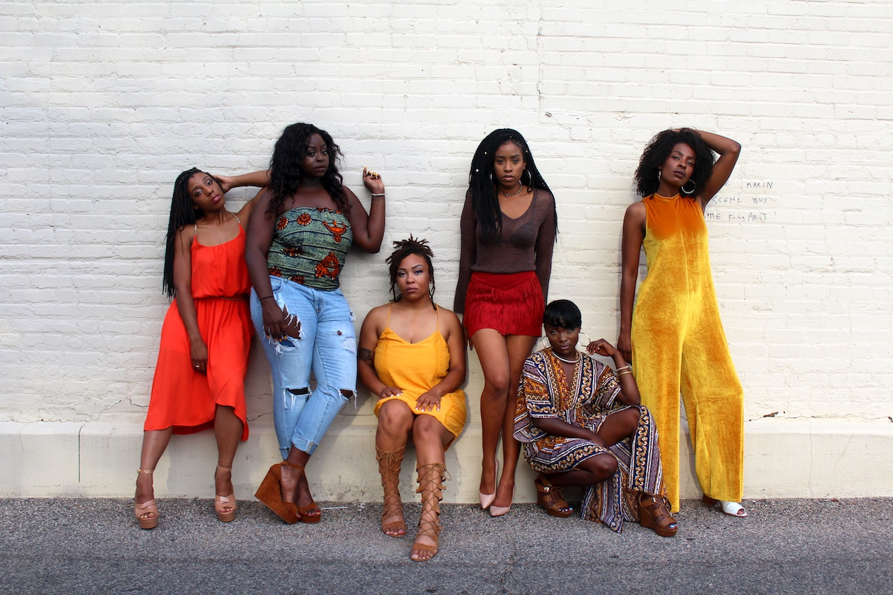

**THE DISMANTLING OF AMERICA**, *Social Unconsciousness* – They violently ripped her from the ground of her own motherland; like snatching a rose out of a garden. They secured shackles on her stems and roots. They robbed her of private moments.

She could no longer bask in the life generating rays of her own personal and private sun. They plucked her petals away; stripping her of her dignity and pride. They physically and forcefully ripped her away from her kinsmen. Tossed into the dry dark bowels of pain and suffering.

The utter degradation of dragging her plucked up body across thousands of miles of rough waterways.

Her soft-beautiful-precious petals drying up in the dark shadows and silhouettes of a large wooden vase.

Heavy tears and drops of blood were the only moisturizer available for her tired and weary soul. 
Her mind racing constantly without seizing, like a long-distance marathon runner but in this race there’s no medals and no desired finish line.
Haunted by fear and uncertainty, never knowing if she would proudly blossom again.

Aimlessly and desperately wanting to die, constantly wondering if this wooden vase would become her floating coffin. 

Inhumanely chained to countless kindred, petrified and alone. Stuffed naked into isolation drinking the tears of others forced to share space where there was no space.
This beautiful soft spoken, loving and caring mother, and wife now forced to become unconsciously angry, aggressive and indifferent. 
   
Instinctively drifting into survival mode never realizing that this form of involuntary confinement would become part of a generational curse.
This brutal bondage marked each rose with a flawed inscription of separation, pain and division.
Forced to accept the unacceptable, physically tired and emotionally weak from skirmishing at the strength of the Atlantic Ocean.

In overwhelming despair, she cries out for her black knight, her strength and protector, to rescue her from this nightmare of pain and brutality. Repeatedly blinking her eyes, with the broken hope that he would appear, and her struggles would be over. He never came.

Days became nights and nights became days. The Sun that she loved so much has betrayed her and now is her enemy.

“Keep fighting,” echoed the voices of our ancestors in her head. “Hold on just a little while longer.”
 Her mind reminisced of home; a place she’d never physically return.
   
She sang the songs of her ancestors silently in her heart: songs of hope, love, life and longevity.
The lyrics of those priceless and precious songs sustained her.

Those words were food for her soul. The rhythmic and harmonic beauty of her ancestors accompanied her on this journey of uncertainty.
    
“How can so many Nubian queens, kings and princesses be captured and chained and ripped from their in own country?” Royalty stripped of nobility and navigated into an endless nightmare.

How can she emerge out of this death trap and once again be restored to a place of celestial beauty and grace? Finally, her voyage ended.

She arrived at an undesired destination. Now the Sun has returned to take back its rightful position but there’s a cost for living in darkness.

For just a brief moment the powerful rays of the sun robbed her of her vision. Hearing but not seeing, barely able to stand she stumbled off this floating prison.

Weak, tired and dehydrated she was paraded through the town like property; improperly escorted by a chaperone not of her choosing or consent.

This walk was like none other, every step was frightening and humiliating, these steps were indicative of an unwanted rites of passage.

With unrelenting anguish, she managed to pull herself together and hold her head high. There she stood stark-naked, shackled on the auctioning platform to be sold into slavery and shame.

She solidifies her stance and gazed with dignity at the bewildered onlookers – a public display intended to humiliate and dehumanize.
   
There she stood proud of who she was but angry and alone. Clothed only in her beauty, glory and her thick beautiful woolly hair.

The cruel and criminal-minded men who would come to own her, coveted her dark and lovely existence. 

This black rose was the most beautiful magnificent human specimen they’d ever seen. They opened the gates of her mouth, examining her teeth. They spun her body around searching looking for defects.

They recognized this one was special, unique and possessed a different type of strength. They meticulously observed her every move. She possessed a deep inner strength that none of their women possessed or previously displayed.

As her existence became permanent, time manifested social change and mental adaptability. 
Her struggle never ended, she fought constantly against lawlessness; psychologically accepting torture and rape over death. 

Yet, Black women grew stronger.
They were pushed and impregnated with rage, hate and resentment. That resentment stretched far and wide.

This hidden rage gave birth to a bastard-like lineage that lashes out toward all men, both white and black.
   
She lives with scars defined by an unspoken narrative of resentment. The black men she once revered and respected, had become submissive and dismissive or they would be hung or whipped.

Men who once looked out for her and protected her were now forced to look away without dignity or die.

Men that raised her children were now being treated less than children or die. Men that once spoke up in her defense were forced to hold her down and watch slave owners violently rape her or die.

Strong men were silenced as she screamed in and yelled out for help. The men that once provided every need were now empty and needy like her.

When the men stood up for themselves and their women, they would be beaten tortured or 
killed “.

To save their young boys from this form of torture and humiliation the mothers would say to their sons. “Look at your father,” she said while feeling forced to explain to little black boys. “Make sure you don’t grow up to be like him. 

“Look at how they talk to him, disrespect him, mentally abuse him, boss him around, and beat him with whips,” she said in anger. “Look at how they kill him and decorate their garden trees with ornaments of lynched scarecrows.”

“Look my son,” she’d say. “Your father will always be present and absent in your life at the same time.” She didn’t know that in saving her son that she would lose her husband.
 
This dichotomy of being absent and present at the same time has haunted and cursed the relationships of black families for centuries.

That systematic attempt led by a racist white society was mentally and socially designed to destroy and subdue the ideology of our ancestors.

Their slave strategies continue to damage the essential components and cohesiveness of families that are native to Africa.

This Willie Lynch directive had a tremendous effect on the psychological aspects of relationships of black men, women and children.

This dismantling of the African-American family forged a fierce wedge in the hearts of African queens. The tragic pressure of black women wearing multiple hats remains devastating.

Living the life as a wife and a slave, yet unwillingly serving as the private, and sometimes public object of unobjectionable sexual pleasure of a rapist. 
Imagine laying and crying underneath your rapist with little black and white children watching and listening to your anguish. Enduring the disrespect, she received from little white children, despite raising them. 

These stories are told again and again – wanting to forget, but always forced, and perhaps needing to be remembered. The seed of memory was planted into the souls of their children.

The seed germinated and grew especially in the gardens of young black girls. The harvest is continuous.

Our daughters are grown, but still haunted by the past of their ancestors – afraid the same fears will follow them into their future. Our black sisters are still waiting for us to rescue them.

They are no longer sitting alone in the bowels of wooden slave ships. Instead they are sitting alone in their homes, sometimes alone with children.

Their men aren’t being hung, beaten and whipped anymore. Instead, they’re being shot, imprisoned and killed. The black man is no longer holding her down, neither is he lifting her up.

Some women continue to insist that their sons not to be like their father. This continuum is counter productive and internally destructive.

Some black men and women defy the odds, but this socio-mentality remains in tact. As a result, some black women have a right to be angry. 
