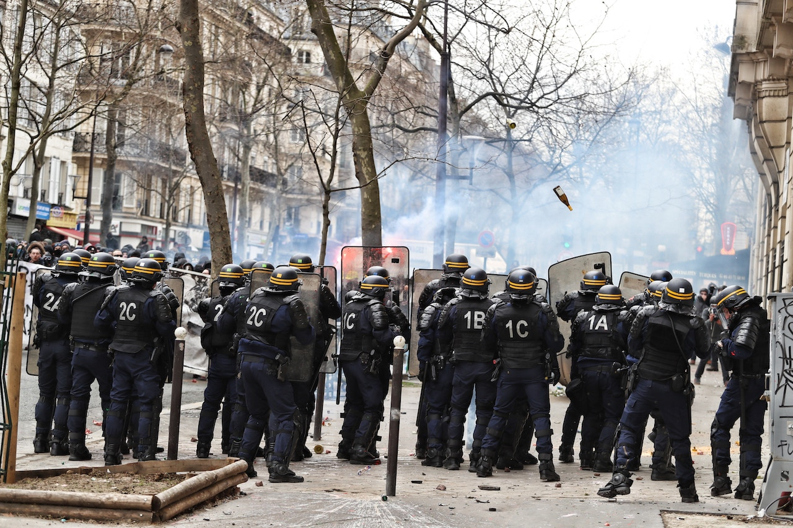

*BLACK-On-BLACK* – An average of 64 police officers are feloniously killed per year. 

The FBI publishes the annual Uniform Crime Report, and this number does not include accidents in the line of duty. 

When you leave home you expect to return. Whether you're going to work, the grocery store, the gym, school or wherever. We all want to return home alive.

Everyday, as a police officer, we have to ask ourselves, “What if someone posed a potential threat to taking your life?” 

Now ask yourself, “What instincts would set in?”

As officers, sometimes our instincts and responses must happen in a split second.

As a result, we are forced to engage in seemingly ambiguous actions no matter the level of skill and efficiency used to resolve certain situations. 

Ultimately, we aim to make the best decisions to protect human life, to include we must also defend our own lives as officers.

However, when we follow our instincts and initiate rapid split-second responses, we find ourselves in an unwanted broadcasted spotlight. 

No one wants to experience the transition from protecting the public to undergoing character assassination in the court of public opinion. 

Imagine providing a testimony or public explanation to naysayers who have analyzed the incident based on hearsay. 

People usually process information based on opinions before the facts even surface. 

They utilize the internet, social media, and news networks for weeks, months, and even years to support one-sided verdicts.

The court of public opinion does not have the authority to serve as judge, jury and executioner.  

Individuals who are not in our shoes, who don’t feel the raw emotion we experienced in the moment will never truly know.

People who have not had to face the possibility of death and leaving their family without a provider are usually driven by lopsided agendas.

These movements are driven daily in our communities with the growth of technology.    

Everything is caught on video and currently the media uses bad videos to turn the general public against their first line of defense.

As police officers, we are not against the community, we protect it. As a Black police officer, I’m caught between the crossfire of social injustices and standing arm-in-arm with my brothers in blue. 

This Black-On-Black blog will expose readers to a deeper perspective based on two brother’s views of law and order.

