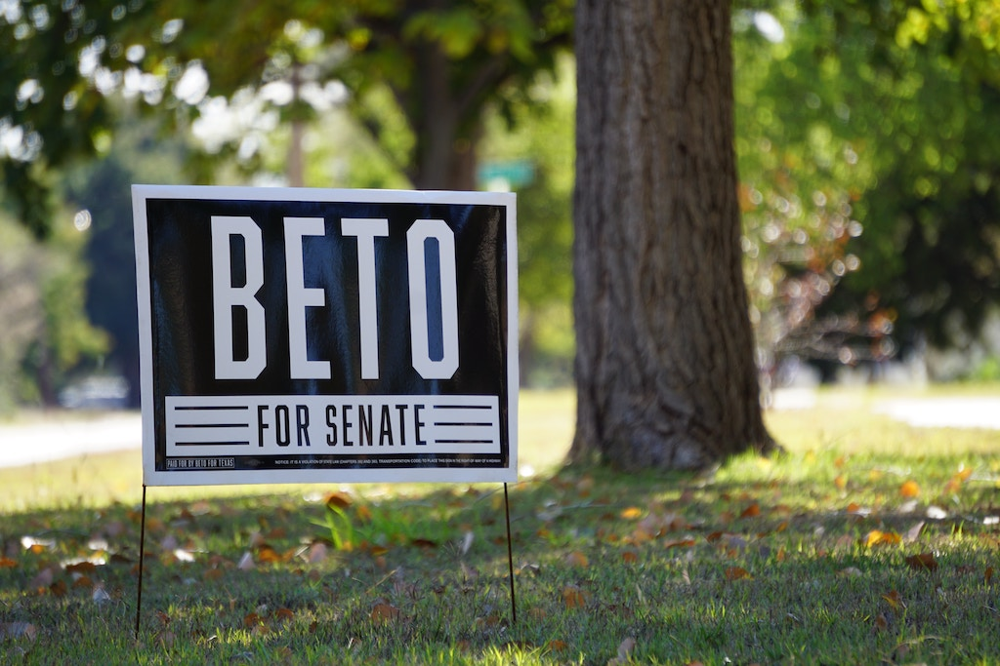

*Straight to the point* - Election day 2016 was like no other for me.  While traveling in Japan, I was getting regular updates about the presidential election.  I still had hope until the bitter end, but when I received “The Text,” my world immediately changed.  
   “Hillary has conceded the election to Trump.” 

Those words glared at me from my mobile.  It felt like my heart stopped, dropped and rolled. A sick feeling crept across my entire body.

I felt paralyzed; wanting to wake up from this nightmare.  Of course, it was not a dream – yet, Tuesday, November 8, 2016 horrendously haunts me daily.

That is when I decided I had to do something – anything. I would not sit on the sidelines and let this nightmare torment me.  

I became an activist and learned very quickly that voting is the key.

The gleaming, shining hope to this nightmarish world, at least in Texas, came in the form of a lanky 6ft-4in congressman, named Beto O’Rourke.  

El Paso native, Robert Francis O’Rourke, nicknamed Beto, exudes a Kennedy-esque vibe that is unmistakable. He not only resembles Bobby Kennedy, but his dynamic personality reminds you of the same Kennedy-style charisma.

Since 2017, when Beto declared his candidacy for the United States Senate, I have been fully involved in helping the citizens in the DFW Metroplex get to know Beto.  

From Town Hall meetings, runs with Beto, and Meet & Greet events, to Billboards, marches and “Yard Sign Pop-Up shops,” the #DFWforBeto team is completely committed to helping Beto in his race to win the U.S. Senate seat.  

The #DFWforBeto page now has 15,000 followers. 

This is because Beto is the real deal and sincerely listens to what people have to say.  

He answers everyone’s questions and does not shy away from the difficult ones. As noted by his response to a question about Athletes kneeling, see:
 
[video](https://www.youtube.com/watch?v=lAw9eXXVwfM)

Sometimes people may not like his answers, but he answers the questions honestly and clearly.  

Beto’s sincerity has no boundaries. He wants to hear Texans concerns. As a result, he travelled to every county in Texas. Yes, he visited 254 Texas counties to listen to locals. He clocked countless miles every weekends, broadcasting his drives on Facebook Live.

Beto tirelessly works to meet Texans and hosts town halls despite the Texas heat, humidity, rain, and mosquitoes.  

He cares and his policies make sense.

He does not want to take guns away from Texans – he wants reasonable gun legislation that is well thought out.  

He does not want to carelessly open our borders, but rather improve the immigration system to encourage and facilitate family reunification, education and bring more talent into our country.    

He wants to modernize the visa system and help legalize the status of millions of immigrants already living here – giving hard working families a path to citizenship.  

Beto believes in all Texans, and his drive and compassion is proof that he will work diligently for all Americans in the Senate. 

Your vote matters, Election Day is Tuesday, November 6th, go vote, and vote for Beto.

