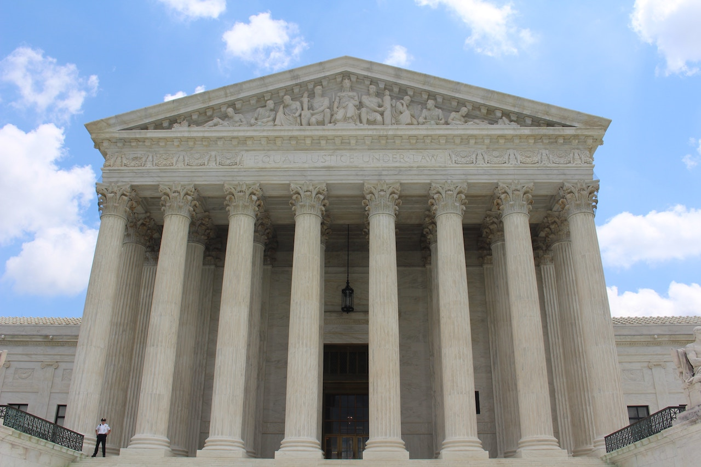

**BY THE NUMBERS**, *Politics and Entertainment* – The more things change, the more African Americans keep missing the point.

We fail to read between the lines, fight against anything mainstream media instructs us to protest, and fail to stand up for our own causes. This is why another conservative justice has occupied a defining seat on the supreme court.

Meanwhile, democrats are crying wolf, walking in place, and echoing the sentiments of the #Me Too Movement to no avail.

Let’s revisit what recently happened, absence of the sideshow.

Perhaps then you’ll understand why today mirrors the history of black people in the back of the bus, using “Colored Only” facilities, and living like secondhand citizens.

## MOST BLACKS ARE CLUELESS CONCERNING THE SUPREME COURT 
 
The Supreme Court of the United States has been our highest ranking judicial body for the past 228 years.  Legislation was passed during the Judiciary Act of 1789, the court originally convened in February 1790.

The constitution Article II, Section 2, Clause 2 gives the sitting President power to nominate, and empowers the Senate to confirm.  

A confirmation to the supreme court is a lifelong appointment, but justices can be impeached – although there has been only one impeachment. The Supreme Court started with six justices, evolving to nine. 

The court receives about 10,000 reported annual requests to review cases, but only process about 80. So, who’s cases do you think get overlooked?

We can only guess, but considering the socioeconomic landscape of our country, it’s no mystery. 

## BLACK FOLKS HAVE BIGGER PROBLEMS THAN KAVANAUGH 

This recent nomination was plastered across print and broadcast media outlets nationwide. Recently confirmed Brett Kavanaugh, age 53, was born in the nation’s capitol, and graduated cum laude from Yale University.  

He worked as White House Staff Secretary under republican President George W. Bush, where he met and married the President’s personal secretary.  

Soon thereafter, he earned an appointment to the District of Columbia circuit court of appeals.
   
Within 2 years of being in the White House, President Trump confirmed two conservative justices, Neil Gorsuch and Kavanaugh.  

Conservative perspectives amongst supreme court justices are officially in majority. 
President Trump’s judicial campaign promise is officially fulfilled.

What does that mean for liberals?

How will this confirmation affect black lives, the LGBTQ community, and women’s rights?
Many remain concerned.

During the nomination, without any collaboration, support or witnesses, Kavanaugh was accused of several offenses which allegedly happened 36 years ago.

Despite 8 FBI investigations, that democrats describe as sham and limited, in opposition they undermined the analyses.

The allegations included sexual assault, gang rape, indecently exposing his genitals and excessive alcohol consumption causing blackouts.    

October 6, 2018, Kavanaugh was sworn in as the 114th supreme court justice – all but 6 have been white men – only 2 have been African American. 

Thurgood Marshall and Clarence Thomas are the only black nominees that have been nominated and confirmed.

## PROOF THAT BLACK PEOPLE ARE CLUELESS ABOUT THE SUPREME COURT

I’m appalled by all of the negative comments surrounding Kavanaugh’s confirmation. Since when have we cared about this good ole boys club? When did black people educate themselves about the supreme court? Do we really have independent opinions or are we once again echoing the sentiments of group think?

African American democrat diehards are chiming in with countless comments in opposition.

When President Barack Obama, nominated Elena Kagen, why wasn’t there an equally loud outcry. 

I concluded back then, that black folks either don’t care or understand the power of the Supreme Court.

Suddenly, our interests changed when President Trump nominated Brett Kavanaugh, even prior to the accusations. 

I found it difficult to even process the comments posted on social media. Journalists and network commentators tried to further diminish the public opinion of the President and eliminate his opportunity to name a second nominee.

In the process, as a nominee, Kavanaugh was served as sheep for the slaughter.

I’m not fan or enemy of President Trump or Kavanaugh, but I remain ambivalent about this nomination. 

I couldn’t help but to revert back to President Obama’s years in power.  

Where were the black nominees? Where was the #Me Too movement? What happened to the idea of black woman or man being nominated – did we even care?  

## THE TRUTH BETWEEN THE LINES WILL SET YOU FREE

Instead, President Obama took the easy way out. He didn’t stand up for us the way President Trump fights ruthlessly to secure the legacy of people in the same socioeconomic status as himself.

I’m not arguing that Trump is a better President.

I am saying democrats and black people should learn from this particular playbook rather then being so quick to squirm, complain, and design more protest signs. 

Antiquated protest-geared political strategies are unfruitful – they cause us to lose campaigns, lose sight of what matters, and lose an upcoming generation of voters.

As a result, when we lose, they inevitably win – and that’s more of a reality than the fancy cliché of “When they go low, we go high.” Losing is not a representation of going high.

Democrats need more than a “Get Out and Vote” campaign. Among other priorities, we need a new and solid strategy that also scripts black attorneys onto the supreme court. 

Perhaps democrats deserve to be miserable now, especially those of us who are black, because we keep failing to read between the lines.  
