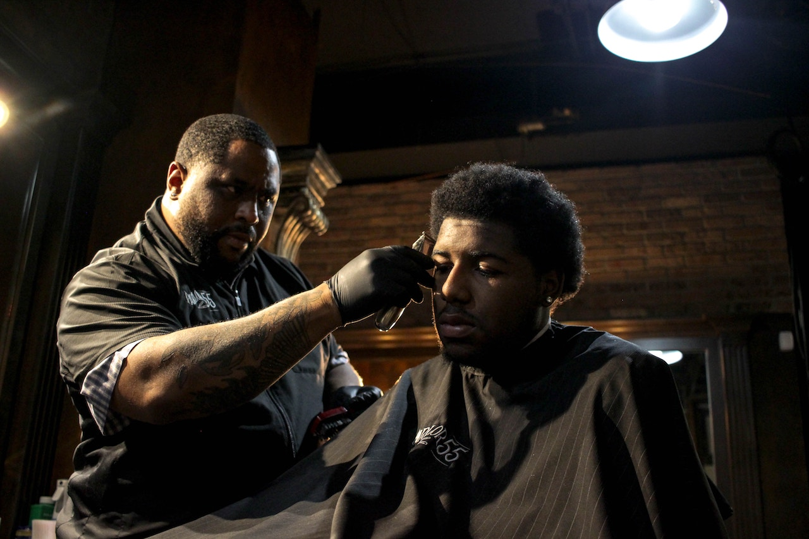

*Giant Haircare* – Haircare requires a sense of artistry and skill, especially for people with naturally nappy women and men with receding hairlines.

For black people, haircare is always a hot topic. It’s a universal subject that leaves so many people feeling frustrated. 

Regardless of ethnicity, haircare requires an asserted effort. Black people have to deal with the added difficulties of obtaining and maintaining healthy coarse hair. While coming up with creative and kinky styles, African Americans must also build confidence, strengthen hair, and creatively highlight our superior good looks. 

Bad hair days happen universally for men and women, also. Everyone fights receding hairlines, balding and thinning.

During the past 5 years, black women have been increasingly going natural more and more.  Many women wrestle with the dilemma of going natural or smacking on the creamy crack. That’s my urban expression for applying relaxers and perms. Who really knows the answer these question for everyone? Do we ask the doctor, hairstylist, barber or grandma? 

Not knowing where to turn or what steps to take is even more frustrating. 

You can look at some naturally nappy heads and clearly tell that they’ve thrown in the towel. 

Ultimately, if you can’t eat it, it’s probably not the healthiest ingredient for your natural haircare. This is true in most cases – most things that your body rejects your scalp does too. While writing my “DOSE OF CONFIDENCE, Giant Haircare” blogs, I will help readers take into consideration all sort of haircare and hygiene confidence tips. 

We will even discuss how different types of medications effect your skin and haircare also, and what you can do about it. Did you know that medication forces the body to do things it wasn’t built to do naturally? 

Making the wrong choices about your hair can be tragic.

Here’s a secret, let’s start by making our own natural products at home, and then testing it on your skin first. I’ll share a few ingredients you should try in future blogs. 

You can thank me later, but I assure you this blog will change your life. I’ve been cutting hair since I was 12-years-old. I’ve been a licensed barber for 17 years, since 2001.

You can actually say I’ve been in the shop throughout a lot different hairstyle fades, from the Jheri Curl, Gumby and High-top fade, to the Caesar South of France and the heavy shag in the back.

I opened my first independent shop named Well Groomed Barber Shop, Inc. on December 6, 2011, in Merrillville Indiana. 

Since then, I’ve been traveling the country conducting seminars on healthy barber techniques. 

I set myself apart from the traditional barber shop experience. First we give every client a shampoo before servicing. 

This enables our clients to relax, and gives us the opportunity to assess the hair and hygiene. 

We always like to start with a clean canvas, like a painter. 

Haircare for black folks demand creativity and I am to be the Picasso of haircare. 
