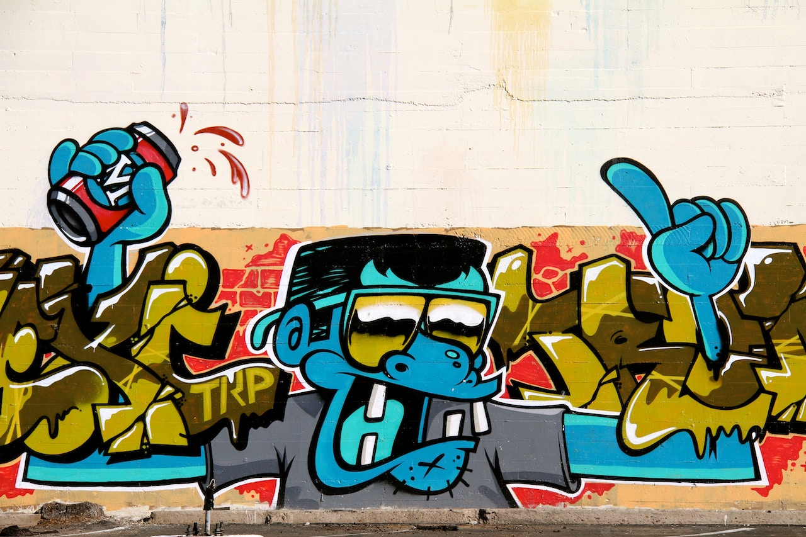

**URBAN LIFE**, *Our Culture and Community* – Dear White people, you have no business saying the word “N” word.

I use it daily, guilt free, and with a sense of pride, keep reading to find out why, because I assure you it’s not a double standard. For the purpose of helping you breeze through this blog, I’ve taken the liberty to replace the full word with the letter “N” in most sentences. The majority of Black people will never accept Anglo Saxons slinging around the “N” word. 

Nigga, nigger, negro or any other variation of the word is unacceptable. The “N” word originally comes from the Spanish word negro meaning the color black. 

This is the word Europeans used to degrade the humanity all people with melanin in their skin, whether they were slaves or not. 

## THE RISE OF THE “N” WORD 

Regardless of what country, tribe or community Africans were from, slaves were treated without dignity and referred to as “niggers”. 

Between 1525 and 1866, during the Trans-Atlantic Slave Trade, 12.5 million Africans were shipped to the New World. Only 10.7 million survived the middle passage while chained to the bottom of slave ships for a journey of several months. This brutal treatment started in the 16th century.

Countless bones of Black body were buried at sea to the bottom of the Atlantic Ocean for almost 400 years until the 19th century. We’ll never truly know just how many lives were slaughtered during the inhumane slave trade.

These people were enslaved, forced to do hard labor, and separated from their families, friends, children and land. Even their identity was taken, which included their language and culture. 
Imagine that. 

Now add to this reality being taught from childhood that you are not even a human being. 

In addition to the mental damage, it’s practically impossible to describe the merciless physical anguish and torture our ancestors suffered. 

While this injustice was happening to 12.5 million Africans, the degrading code name White people used to justify their actions and describe their cargo is “nigger”. 

## THE ADOPTION OF THE “N” WORD

After the 1865 Emancipation Proclamation declaring the end of slavery, Black people still were not considered humans or worthy of any type of humane treatment. 

Although Blacks were legally free, my ancestors who looked just like me, couldn’t participate in daily activities with your White ancestors who look just like you. 

When people forget important pockets of history or fail to acknowledge it, societies manage to repeat it – Black people aren’t going ignorantly allow that to happen.

We couldn’t eat in the same restaurants, ride on the front of the bus, drink from the same water fountain, or voice our opinions. 

With our heads hung low, our men were beaten, our women were raped, our loved ones were hung from trees during routine lynching. 

All the while, we never retaliated, we only wanted equality. 

Repeatedly, history replays itself and illustrates to us that we are not equal to Whites in America – so we continue to stand up and speak out against injustices – even risking our lives for it.

Most Whites continued to refer to Blacks by the same degrading term of the “N” word after 1865.

In fact, on December 24, 1865, the Ku Klux Klan was born in Pulaski, Tennessee. This secret society continues to hide underneath white hoods spread racial hate.  

Blacks didn’t necessarily live on slave plantations after 1865, but they definitely weren’t free from segregation, discrimination, and degradation. 

Some former slaves stayed on plantations as sharecroppers because they no place to go. Their identities were annihilated. As a result, we still have no clue who we are as a people today.

This is why we are always transforming through new renaissances of reinventing ourselves. 

No matter what we did, our dance, walk, talk, art, literature, music, and inventions were referred to as “the ‘N’ word this” and “the ‘N’ word that”. 

Nowadays, more and more whites are emerging into the Black experience and kidnapping bits and pieces of our culture to claim as their own.

White people can sing, dance, talk slang and even marry into our families, but we will not accept or standby silently and listen to you use the “N” word – it’s off limits.

After being called a the “N” word for so long, Black people started calling one another by the term. After all, Anglo Saxons brainwashed our ancestors after stripping them naked of beliefs and principles – the “N” word was the only term we knew to refer to one another as. 

Of course, we have a different dialect from Europeans, so, what sounds like “nigger” to Whites, became “nigga” for Blacks. 

## NAME CALLING VS. TERMS OF ENDEARMENT

Here’s my logic behind why it’s acceptable for Blacks to say the “N” word and it totally not cool for Whites. 

I have a friend name James. He was born with one leg much longer than the other. All of us friends that grew up in the same neighborhood called him “Little Leg” and he answered to it with no problem. 
He knew we meant no ill will and that we were not the cause of his one leg being shorter than the other. 

Instead of cowering behind his disability, we took something bad and tackled it face first – we embraced it and made the best of it.  

Now, if you were not considered family to James, and you called him “Little Leg,” you’d get an unwanted response. You couldn’t possibly mean it the same way as his caring friends who are connected and committed to his struggle, because you don’t have that kind of relationship with James. 

No matter how much you try to explain your innocence and unintended negativity, if James tells you not to call him “Little Leg,” then why is it so hard to respect his wishes.

It’s actually distasteful, disrespectful, and wages conflict.  You have no bond with him. You don’t know the obstacles he had to overcome. Neither were you there to help him overcome them.

Hopefully you already see where I’m going with this. Black people calling one another the “N” word is like a family thing. 

We twisted a negative Anglo Saxon expression into a term of endearment used amongst other Black people because we share the same struggles. 

We share a personal bond, a deeply embedded history, and an unquestionable understanding as to why we call each other the “N” word. White people called us the “N” word to put us down. 

We say it specifically to lift one another up.  It’s a way of saying “I see you and I know your struggles.” 

## A TEST OF YOUR CHARACTER 

On the other hand, the White American meaning of the word hasn’t changed or evolved. So when a White person says it, it still carries the same disrespectful and demeaning connotation.

White people that still don’t understand why to avoid the “N” word, should ask themselves why are you so eager to say it despite having a thorough understanding. 

Do you ask Mexicans why can’t you call them “wet backs”? Do you call Chinese people “chinks” when you become their friends? Do you really think it’s appropriate to call people from the middle east “camel jockeys”? Of course not, so then why are many White people so desperate to gain permission to call us the “N” word?

Even worse, you want our permission to do it, and for us to accept it.

Consider this.
Strange enough, a lot of young adult women of all ethnic backgrounds call one another by the five letter “B” word.

Let a nearby listener approach those same women and say, “What’s up ‘B’”?  I assure you that greeting will rapidly cause the situation to spiral downward. The “N” word carries a similar connotation, but not profane.  

The bottom line is, it’s a family thing, and if you’re not born into this family you are not allowed to practice our customs, despite how intrigued you are about our culture.

Yes, Hip Hop artists are going to continue to say the “N” word in their lyrics. 

As Black people, we created Hip Hop as a freedom of our expression, experiences, and creativity, which makes it uniquely our own genre of music. 

Freedom of expression without respect or consideration of others is called vandalism, defamation and degradation. 

So Black artists have every right to use that word to describe, echo and promote their personal experiences.

When Black people use the “N” word, it undermines what White people originally intended. When White people use the “N” word it undermines the dignity and humanity of all Black people. 

So, if you ‘re not Black, respect our history, journey, struggles, and pain by not using the “N” word under any circumstances. 
