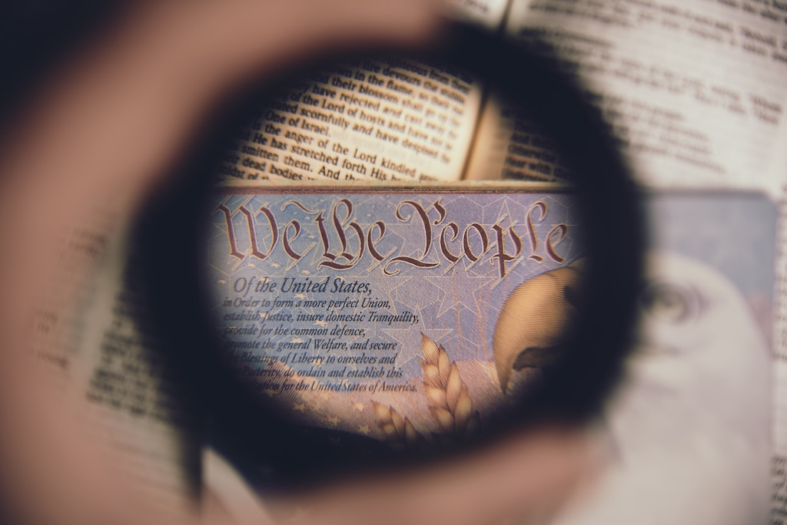

*Straight to the point* – I couldn’t catch my breath – we were all petrified. The first time we stood face-to-face I could almost hear my heart pounding erratically against my chest, tears leaping from my eyes, and goose bumps spreading across my entire body. 

It was gruesome, shameful, and despicable, in so much that we seldom speak of it. We weren’t intimidated by the man blowing the dog whistle, our greater threat was the actual dogs themselves. “…it was vicious and hateful – in effort to feel superior, it dehumanizes us,” they repeated.   

### THE BIRTH OF A NATION

Racism embodied America at its inception. Since it’s 16th century birth of the Transatlantic Slave Trade, to the cry for Civil Rights in 1875, racism in America grew through its infancy. 

It is now a fully developed dictator, dividing religious groups, defining socioeconomic boundaries, determined to devastate and dangerously script diabolical American politics. 

Racism destroys. 

It is a self-destructive poison embedded into the foundation and fibers of this country.

### DIVIDED WE FALL

By 1861, America was utterly divided. The Emancipation Proclamation of 1863 waged proof of the invisible lines that separate American ideology. As a result, we experienced the American Civil War from 1861-1865. The industrial north fought to liberate slavery from the Confederates, south of the Mason Dixie. 

Irrespective of Confederate defeat, continued degradation, slavery disguised as sharecropping, segregation, discrimination, brutal violations and lynchings of black lives continued for a century.

The north won the Civil War, but racism prevailed. 

The fact is, the war against racism in America never ended. Our political incorrect culture claims not to see color. As a result, we pretend as though there’s no giant elephant of racism trampling across America’s front lawn.

Pretending is difficult when you are shackled by the framework of U.S. Constitution, blindsided by the U.S. Justice System, and caged in urban communities designed as death traps.

### KILLINGS OF THE KU KLUX KLAN

The Ku Klux Klan originated in 1865 as a secret society, publically terrorizing blacks after the defeat of the Confederate states. In 1918, the Klan advanced its violent activities, lynching 63 blacks. By 1919, there were 83 more recorded KKK lynchings. 

According to Tuskegee Institute archives, approximately 3,446 African Americans were lynched during the era of 1882 to 1968. This same study indicates that 1,297 whites were also lynched. White people who didn’t participate in hate demonstrations were often labeled as “nigger lovers”. 

The date we now honor as Veteran’s Day, November 11th, concluded the 4-year-long World War I in 1918. Over 60 million soldiers died worldwide - over 100,000 Americans died. Many white soldiers returning home were angry because the Great Migration of blacks that relocated from the south caused an influx of over 100,000 blacks occupying Chicago’s industrial jobs. By 1970, six-million African Americans relocated from southern states to the urban Northeast, Midwest and West.  

Chicago police failed to arrest a white man who stoned a teenage black boy to death in front of witnesses. Race riots broke out in Washington D.C., Tennessee, Texas, Nebraska, Arkansas and the worst in Chicago. As a result, in the Windy City, 23 blacks and 15 whites were murdered, 500 individuals were injured, and 1000 black families lost their homes in fires.  

### EVERYTHING CHANGED AND RACISM STAYED THE SAME

History took its course, by 1968, racial tensions continued spiraling downward in America. We proved to be a country of racial hatred.

White men hiding beneath masks and hoods burning crossing at midnight, and then scripting by-laws of major corporations and political practices by day, embedding racism into the culture of the country.

It is unequivocal that racism is a system of using power to institutionalize prejudice and discrimination based on the belief that one’s own race is superior. 

In 1968, on April 4th, Civil Rights leader Dr. Martin Luther King, Jr. was murdered. Two months later, on June 5th, the 35th United States President John F. Kennedy was assassinated.  

The year continued racial turmoil when gold and bronze Olympic medalist Tommie Smith and John Carlos raised their fist on the podium as a show of black power salute. 

The 1980’s marked a new-aged starting block of racial injustice defined by the upward spiral of mass incarceration of blacks. 

The systemic smuggling of cocaine and heroin raged in urban communities. 

Poverty, fatherless households, drug addictions, poor education systems, high crime, miserable living conditions, underprivileged healthcare systems, stray bullets, and black-on-black homicides became the secret society’s strategy for urban self-destruction. 

These conditions reflect a sense of overlooked and overpopulated black lives caged in urban jungles.  By 1996, black youth were publically regarded as super-predators to esteem White House initiatives.

With limited socioeconomic resources, black families struggle like savages to survive. 

Countless cops brutally beating and killing unarmed blacks without consequences or indictments echo the sentiments that “black lives don’t matter in the American judicial system”. Modern day racism is armed with bullets and shielded with badges – no capirote needed.

### RACISM IN THE MEDIA

Broadcast and print media plays a secret part in this modern society of racism – concealing facts, exposing deflections, misrepresenting communities, and advancing biased agendas. 

Networks and newspapers politicize random hate crimes and racially charged movements as strategies to secure votes – usually to no expected end. 

To advance the struggles of race relations and leverage civil injustice in America, a proven, polished and politically savvy President is needed. We must avoid male and female candidates who throw stones at the black culture and then hide their hands during election seasons. 

Unfortunately, when journalists are biased, we undermine centuries of racism that continue to oppress black lives. Popular white people in the press, singling out other white politicians do not change circumstances, raise consciousness, or add context. 

Accusations of hate, claims of racial injustice, and biased idiosyncrasies are circumstantial in the eyes of public opinion. Pointing blame only gains emotional appeal. 

What next?

Aside from rousing the crowd and raising ratings, it takes well-thought-out strategies to dissolve the deceit that endorses a long standing unjust system of racism. 

### THE CREMATION OF A CONSTITUTION

Any suggested resolution to liberate racism in America that does not repeatedly revisit the constitution is an epic failure. The Constitution draws a defining line between the privileged and underprivileged. 

Black people as a whole are disadvantaged beneath the struggle of systemic racial hatred. 

Denial of systemic racism is nothing more than a trump card pretending as though America’s white ancestors and constitutional forefathers did not script hatred into the inseams of this country. 

Our American history rings proof of these injustices. Long before this current era, nothing trumps the reality that black lives are under the feet of racial oppression.

A few financial, academic and athletic success stories are minuscule compared to four centuries of bottle-necked achievements that leave so many trapped.

Racism is the godfather of America’s unending civil combat. Pampering racism like a fragile newborn is unacceptable.

Racism is not an excuse to surrender to mediocrity. We should not seat silently on the sidelines as corrupt candidates use it as a political scare tactic to hypnotize black voters into blind obedience.

As long as we allow outside influences to dictate what we think as a group, we will never overcome as a people. 

If America aims to recover from the post-traumatic devastation of racism, our greatest reparation will arise from the ashes when we cremate the remains of the hate white men created.
