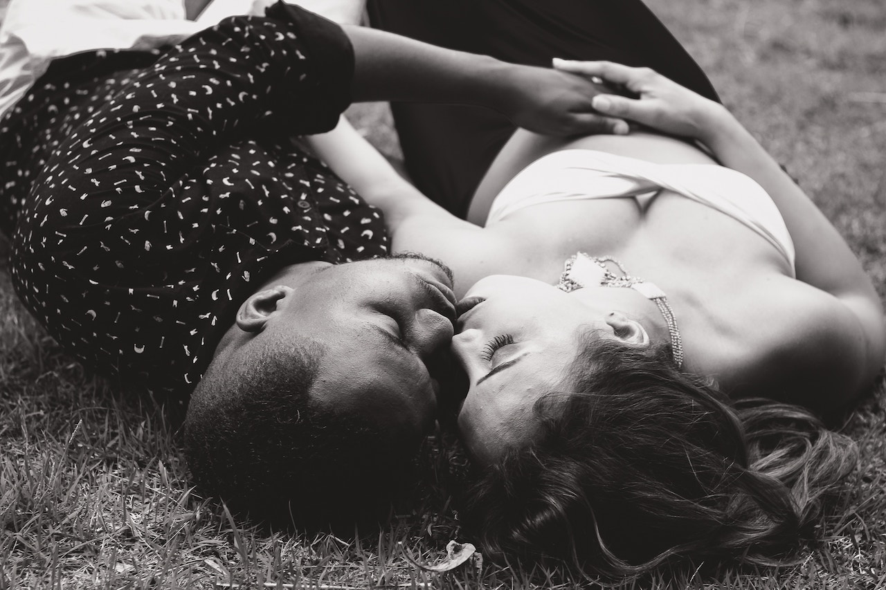

**TRUTH IN BLACK IN WHITE**, *Interracial Dating* – Elephants are powerful and intelligent animals. 
If you tie them with a simple piece of cheap rope when they are young, it’s enough to restrain them mentally. 

As they grow, they are conditioned to believe they cannot break free. They believe the rope is still restricting their freedom, so they never attempt to escape.

My ancestors were enslaved for over 300 years. Nearly 150 years later, people are conditioned to submit to old taboos based on physical chains that used to restrain Africans – now Blacks fail to free themselves. 

When I first considered who I want to spend my life with, I knew I wanted to be with someone that loves me for who I am. 

Ultimately, I realized I needed to be with someone who cultivates a mindset and a lifestyle of liberty.
As a black man, when people realize that my fiancé is white, the responses are nothing more than inflated pleasantries. Comments like, “That’s sweet,” and “How long have you two been together,” or “When is the wedding?”

Although I can feel the awkward energy and sense the underlining questions. Here’s what they really want to ask. “Why are you dating a White girl,” or “Why don’t you date Black girls?” I know this, because after the chitchat some people are actually bold enough to ask.

There rude and ignorant question unequivocally justifies my first point about elephants – people are still mentally enslaved, brainwashed, and trapped in the past.

I usually give surface answers to these questions to avoid stirring an offensive conversation about my right to love whomever I choose. 

I am an American, which means I have the right and the freedom to date and marry at my own discretion. On a deeper level, I need to reach a point where my mindset and my lifestyle exudes freedom.

My ambition is to avoid negativity. 

It’s important that I do not tolerate anyone or anything that is counterproductive to my ability to make my own choices without pessimistic viewpoints.    

It’s not that I don’t date black girls. Perhaps I would if I weren’t engaged – I’m passionately in love with an amazingly smart and beautiful woman who happens to be a White human being.

There you have it – my answer in black and white – and I probably won’t explain my decision again.
So, consider this blog an exclusive. 

I refuse to waste time explaining my actions to mentally enslaved people who think my relationship is the elephant in the room, when in fact, their ideologies actually are the obvious problem. 

The point of this blog is to celebrate my interracial dating experience and raise awareness about love beyond the boundaries of ethnicity, race, gender, or nationality. 

Join me as I share pieces of my relationship, the laughter, tears, upsets and successes – the heart of who I am.  
