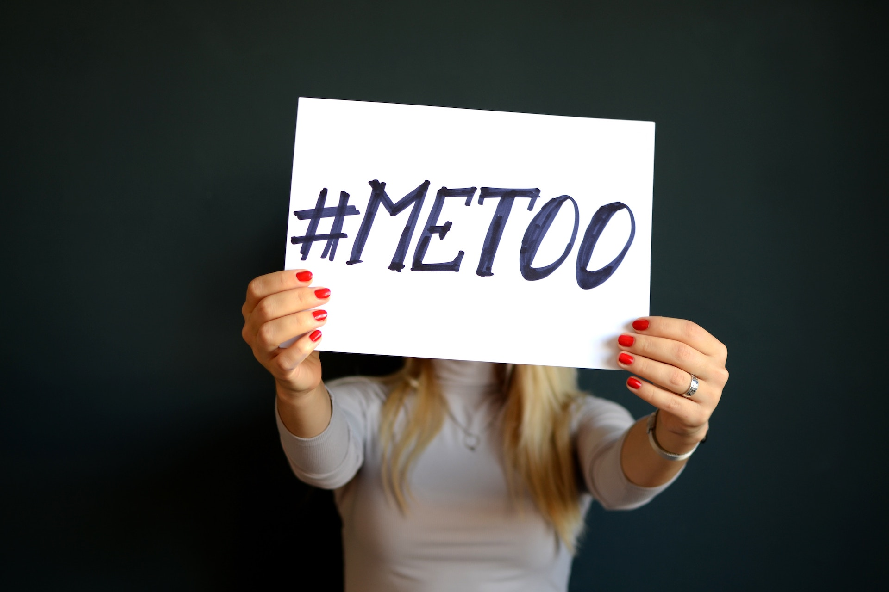

**BLACK DADS MATTER**, *Fatherhood in Urban Communities* – Perhaps it was me too. The *#Me Too* movement has undeniably impacted how women are battling the issues of sexual harassment and abuse.  

Being a father of a young girl and young boy, I felt it important to have a better understanding of the issues that this movement is addressing.  

Upon researching the details about sexual harassment and abuse, the facts proved astounding.
For instance, 18.8% of black women report that they have been sexually assaulted in their lifetime. For every black woman that reports an assault, at least 15 don’t tell.   

I also learned about the concept of sexual coercion. This is when someone does or says whatever is necessary to get sex. In other words, this is when a guy tries to be a *“playa”*.  

Approximately 40% of black women report that they have experienced sexual coercion by the age of 18.  While growing up in the black community, this concept is part of the masculine culture.  

Being a *“playa”* defines social status and rank for young black males. It is something that is instilled and reinforced from generation-to-generation.
  
I have to admit that I’ve fallen prey to this faulty belief. Being a *** stirred a sense of respect and admiration within our male peer group. However, this social expectation is detrimental to the women that we claim to love and support. 
 
Currently, it is also viewed as a form of sexual harassment. The use of lies and manipulation to get sex out of women creates an environment of distrust. This environment has helped to create a divide in the black family. 

Not all men adhere to this social expectation. However, the societal pressure for young boys in the black community to live up to this belief is undeniable. Is that what you want for your son or daughter? Not me.  

So, I had to come to the conclusion that a discussion with my son was necessary. We talked about the negative and dangerous aspects of being a *“playa”*.  
 
I want to consistently teach the values of respect and honor to my son. He will have to learn that manipulation and deceit is not the way to build any relationship. 

Unfortunately, I will also have to teach my daughter some difficult lessons. In our society, sexual harassment is practically inevitable. The best steps I can take as a dad is to prepare, equip, and warn her to take precautions.

I have to teach her that boys are going to test her, and eventually someone will probably take it too far.  I will prepare her for that moment, and let her know that she is not responsible for his immature, misguided, ignorant and perhaps even illegal actions. 

God forbid my guidance and warnings manifest into reality. 

In the event it does, we will discuss the importance of talking with me, being open, and not feeling responsible for the negative actions of others.  

Multimedia, marketing and music all play highly influential roles. In most cases, the music industry unknowingly perpetuates social norms without assuming responsibility. The Hip Hop and Pop cultures send subliminal sexual messages in a lot of their music. 

In a sexually fluent society, entertainers feel forced to submit to societal norms in order to increase sales and promote popularity.

This catalyst directs young people, especially Black men, to live up to this image. As a result, all too many young Black females accept and comply with this belief. 
 
R&B singer and record producer, Joseph Lewis Thomas, usually referred to as Joe, released a hit 1997 song titled, *“I Don’t Wanna To Be A Playa”*.  I agree. The lyrics to this song ring true for *#Me Too*.

If we want to build our community and strengthen our Black families, some key components concerning our culture must change.
