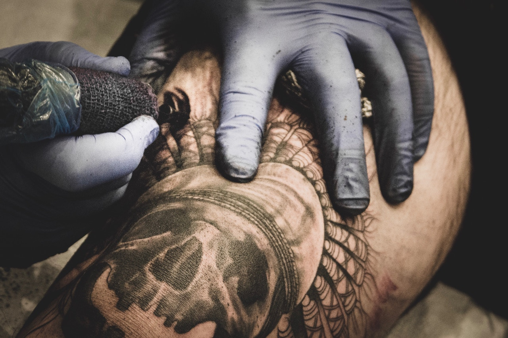

**CREATIONS CARVED IN INK**, *Art and Design* — Art is anything that inspires humanity to act or react. I’m a tattooist, graphic designer, illustrator, and amateur rapper, in everything I do, I aim to inspire. Ultimately, I’m an artist. 

Recently, I got an opportunity to start blogging about my passion – art. This is why you’re reading this introductory blog, because artistry has a way of opening doors, and my gift has officially made room for me as an artist at Paideia-Tribune. 

What is Art? 

It’s the expression or application of human creative skill and imagination, according to Merriam Webster.
Aside from the formal definition, art is everywhere, and if you look close enough you can see it in anything. 

Art can be used as a voice to tell a story, convey thoughts, battle with words, bring strangers together, or even divide close friends.

Art is powerful.

The creator of a piece may have one intended message, but the viewer can potentially perceive something completely different. This is why every aspect of artistry demands planning, thought, development, and practice. 

Art creates a mood.

It stirs all sorts of memories and emotions, from happiness, loneliness, and sadness, to laughter and love. 
Have you ever reminisced over an old photograph? Perhaps memories from the picture jerked tears from your eyes. 

Photography is another art form, along with dance, architecture, poetry, and so much more. Art can be displayed in many ways, such as paintings, sculptures, drawings, billboards and tattoos. There is no limit to art.

Art is a part of our everyday life. Look close enough at skyscrapers and houses and you’ll see craftsman-style artistry. Look at food packaging in the grocery store – some artist designed every individual item. Look at your own wardrobe and notice the fashion artistry that you’re probably most attracted to. 

Nothing in this world was created without some type of art influence. In essence, many people argue that art is what rules the world. I agree. Seriously, take a look around you, and you’ll notice that art is everywhere.

True artistry generates an inner passion – you’ll know when you’re an artist because you’ll love doing what you do.

It’s a unique energy that comes from within. 

Working hard to enrich your craft, investing funds to improve your quality, and repeatedly practicing to achieve perfection is what true artists do.

Others plagiarize, copy, and duplicate the ideas of artists who have come before them. Plagiarism is despicably frowned upon in the world of art, despite the genre. 

If you’re truly an artist, inspiration is all around you. I recently went to Arizona and Nevada and was impressed with artistic influences in the landscaping, in the mountain rages, the Las Vegas strip, and the Grand Canyon. Afterward, I returned to the Midwest inspired.

As I blog about various art forms, featuring different artists, I hope to gift readers with a euphoric sense of inspiration with every blog article. 
