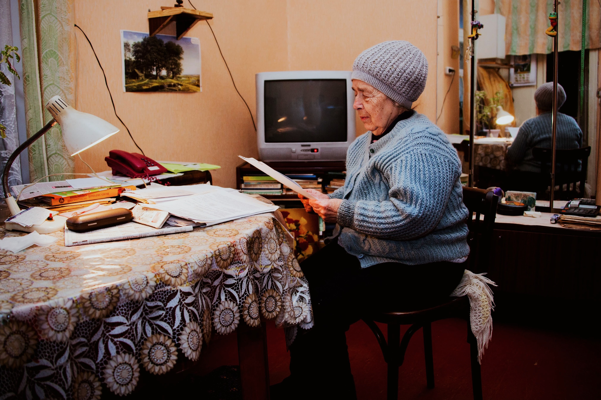

**MINDING YOUR BUSINESS**, *Entrepreneurship* – For our first 18-years of life, parents sacrifice to accommodate our needs as dependents.

Age has everything to do with dependency, for the young and old.

In life, roles change – the people you needed as a child, often need you as they age.

Our parents are getting older, and soon they will need our help with living arrangements. 

Let's talk about the history and evolution of assisted living.  

In modern day society, data suggests that people are living longer. 

In the early 19th Century life expectancy starting to increase due to countries becoming more industrialized and medical advances. 

Since 1900, the global life expectancy has almost doubled.  In 2016, the average lifespan in the United States was just over 78 years.  

Along with an increase in life expectancy, there has been an increase in the number of years that people live with some sort of disability.

In the United States, people suffer from disabilities about 11 years during the end of their lengthy lifetime.

This is important in the arena of assisted living.

Prior to medical advances, elderly individuals were treated like there was something wrong with them.

When they reached older ages, they were often placed in mental institutions.  

Eventually there came a realization that this segment of the population was not mentally ill, merely aging.

Elderly individuals often need assistance with activities of daily living. 

They need help with a variety of things like bathing, dressing, eating and maneuvering.

According to the Pew Research Center, as of December 2010 Baby Boomers numbered 79 million and account for 26% of the U.S. population.  

Current research illustrates that approximately 4,000 seniors are turning 85 everyday.  

Beginning in January 2011, reports estimate that about 10,000 boomers will turn 65 everyday for the next 19 years.  

This totals nearly 1.5 million new 85-plus elderly each year, and over 5-million in need of accommodations. 

A stay-at-home family member can help.

Nursing homes also accommodate elderly individuals, which is a living arrangement designed to function as a medical facility. 

Another option is hiring an in-home care taker, which averages about $23 hourly.

An AARP survey showed that 90% of all seniors would rather live in their own home throughout the rest of their life.  

Here’s where assisted living come in offering elderly individuals two options. 

There is the “big box” facility which feels more like a nursing home and there is residential assisted living.  

What does this mean for the investor?  

These soaring numbers and innovative concepts mean everything to investors. 

There are thousands of new and seasoned investors looking for what’s next – some new investors are searching for a safe first investment. 

Very few investment opportunities have a built-in revenue stream based on one factor such as age. 

We, as the children of these Boomers, have the privileged responsibility to give our parents the absolute best. 

They did it for us. 
