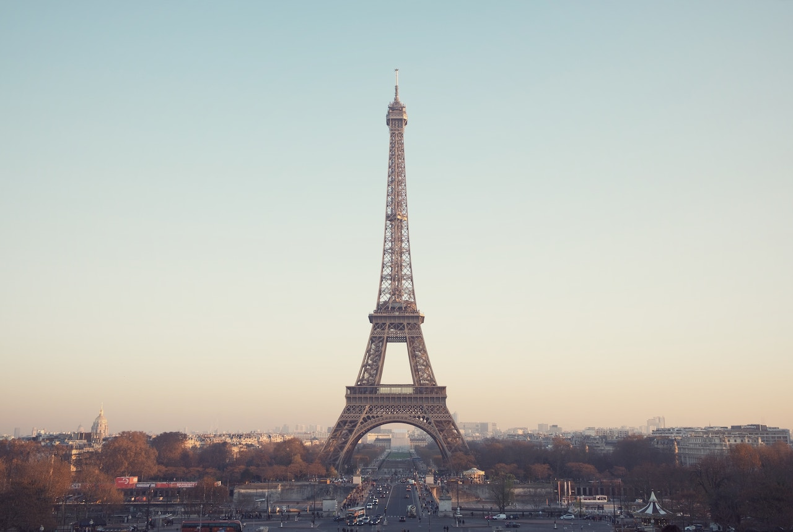

**STRICTLY POLITICAL**, *Straight to the point* - As we give thanks individually, it’s good to remember the things we as a nation, have to be thankful for as well. 

I continue to have hope that our country will be able to correct its course.  

Strangely enough, I was reminded of this by a shop owner in Paris this week.  

When he learned where I was from, he said *“c’est magnifique,”* meaning that is wonderful or splendid!  

I inquired about his response, given state of the current administration.  

He replied, *“Your country and the people are still great!”*

That statement reminded me of what we are fighting for, now-a-days, on a daily basis.  

Granted, it’s tiring and draining to hear about new controversial issues created by an individual

known for TV drama queen, in his case an actual a drama king. 

After the mid-terms, many of my activist friends are taking a break from politics.  And I think that’s ok, but we can’t stop.  

We have to persevere and continue the fight.

To say that there was a blue wave in 2018, is not actually correct.  

We made some inroads and of course won the House (of Representatives) back.  

But, the word *“wave”* was used to describe a tsunami type of a wave that washed away the mess and 
made way for new life. 

Is this what we currently have what we really want – will we settle for this?

Is this what our founding fathers imagined for us?

The United States of America was founded on certain principles that we need to be reminded of occasionally.  

Individual freedom, the right to own property, and that *“All men (and women) are created equal”* are some of these principles, to name a few.

We cannot forget that the founding fathers were wise and also included a system of checks & balances.  

This means that each branch of government can stop the other from growing too powerful.  

We have a right to representation and the national government has only those powers that are granted by the constitution.  

Don’t forget that last point! 

Especially when we hear that immigration laws will be changed with an executive order. This just can’t happen! 

That’s just drama, drama and more drama.

So, what we truly need is an equal and balanced government where the two majority parties check each other and encourage positive debates and changes.  

No single party should make all the decisions, because this country is made up of diverse people, with different needs and expectations.  

Equal representation, equal votes, and good thoughtful decisions will maintain the greatness of this wonderful country.  

We cannot give up, we must not give up! This is the time to right our course! 

Times like this call for everyone to be more involved and more aware of the political environment.  

If we don’t, someone else will make decisions that will affect us all, now and in our future.

To say that you are not political is just an excuse. Politics affects all of us in our daily lives.

There are different levels of involvement; at a minimum, you can commit to getting informed and vote during every election.  

If you don’t vote, you have no right to complain. It’s as simple as that! 

You have the power to keep this country great. Voting causes your voice to be heard.

Be thankful we live in a country where we have a voice - Happy Thanksgiving!
