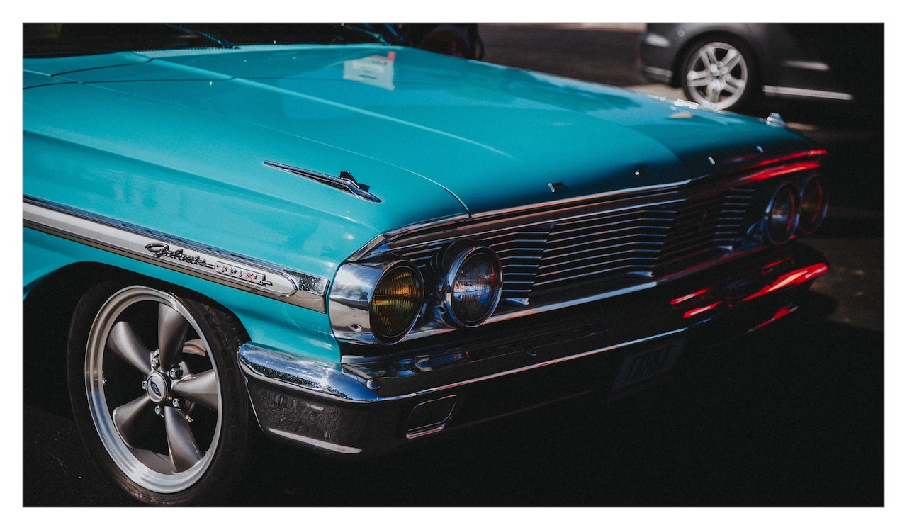

**CREATIONS CARVED IN INK**, *Art and Design* — As an up-and-coming tattoo artist, my signature name is Cashmeretat2.

Tattoo artists have different styles, I specialize in freehand lettering and detailed black and gray work. 

This hands-on journey started in 2014, but my love and industry interest goes back over two decades.

At about 12-years-old, I got into collecting magazines of low-rider cars.

As a result, I always searched for the low-rider magazines at the local grocery store. 

My mom would buy them and I’d spend countless hours looking at the cars.

One day, I noticed the artwork in the back of the magazines.

Artists would submit images of their love for the culture of low-riders. 

This one amazing artist captivated my attention.

His work depicted unique fancy script and custom lettering, beautiful women with clown painted faces, virgin Mary as well as other important figures in the Hispanic communities. 

The Latino style is called Chicano art.

From that moment I was in love with it. 

I started noticing that the owners of these low-riders had personal artwork designs that were on the back of the magazines.

Art covered their entire bodies – my mind was blown. 

The low-rider magazines were my first exposure to such creativity.

That’s when I started to study and mimic the Chicano art style.

Soon after, I put my own spin on it. 

Low-rider magazines introduced me to Chicano art, and this is the reason I specialize in lettering and black and gray today. 

I remember showing the magazine to my mom in excitement.

I said, *“I want to have so many tattoos that I’ll have a shirt on without having on an actual shirt.”*

I got my first tattoo at age 17 – it was my junior year of high school – without my parents’ permission of course. 

The tattoo was a basketball with my initials inside of it – I hate it now – I’m laughing about it, but seriously, I don’t like it. 

It was a difficult-to-explain experience that I’ll never forget.

Before I knew it, I had over 20 tattoos with no plans on slowing down – I was working towards that tattoo t-shirt. 

Even though I spent lots of time in tattoo shop and sketched my own artwork, I didn’t think to pick up tattooing as a profession. 

I even started getting paid to transform ideas into tattoo designs, allowing others to apply the ink.

I thought that was the coolest thing ever – friends and associates having my creations displayed on their skin. 

It wasn’t until 2011, that close friends started planting thoughts about me becoming a tattoo artist myself.

I was working on starting a clothing brand at the time – my entire life has been about art.

I made a deal with myself.

Wherever the clothing brand was in 3 years, I’d take a break and pursue my passion as a tattoo artist. 

The timeline shifted, but here I am up-and-coming, branding my own unique tattoo style as Cashmeretat2.
