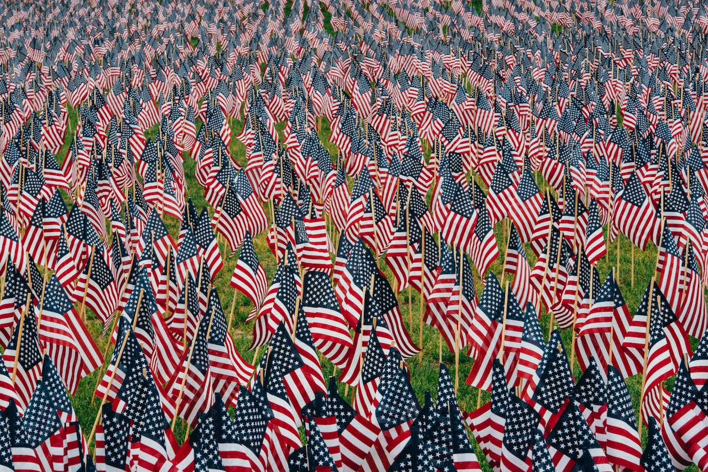

**THE DISMANTLING OF AMERICA**, *Social Unconsciousness* – What will the end bring? Why is society afraid? When did we foster this society where everyone lives in constant fear?

Fear continues to cripple our nation.

In many ways, they are afraid of us, and we’re afraid of them. Who are we and who are they? Why is there a *“them”* and an *“us”*? Who created this separation, who maintains and promotes it? Who injected this fear into our society, and for what purpose?

There are so many questions, and an equal amount of concealed answers.

A young man was shot to death by another citizen that looked like *“them”*. Two police officers were gunned down while sitting in front of a restaurant by *“us”*.

A man was shot to death in front of his wife and child by *“them”*. 

Several police officers were gunned down in Texas, for no reason, by *“us”*. A little boy was playing with a toy gun and he was murdered by *“them”*.

They’re killing us, and we are killing them. We both have families, spouses and children. Our families are afraid, their families are afraid, we’re all afraid of one another.

People often hate what they fear, and hatred has spread across our nation like a poison. 

When they take off the blue uniforms they look just like us. They eat, drink, pray and sleep like us.
We don’t want to die for making a mistake, and they don’t want to die while doing their job.

When we’re in danger, or trouble arises, we anxiously await their arrival.

When they’re in distress, they don’t want to see us – they don’t trust us. I’m related to some of them, and they’re related to some of us.

This fear that separates us has to transform into an adhesive that binds us together. All of them aren’t good, and all of us aren’t bad.

In order to heal the wounds of yesterday, we have to patch promises of tomorrow. 

Those that have passed away must never be forgotten. Yet, those that are still here must always be remembered.

We have to remember that there is no *“them”*, and there is no *“us”*. We are all citizens in this Divided States of America.
The only thing that can mend and heal a divide is a bridge. A bridge starts on one side and cascades over to the other. 

That bridge crawls over racism, skips beyond racial profiling, leaps over corruption and runs through injustice.  

On the other side of that bridge, humanity is merged into one united embrace.

We have to build that bridge together, without *“us”* or *“them”*, or fear will drown us all in the red sea of our own blood.
