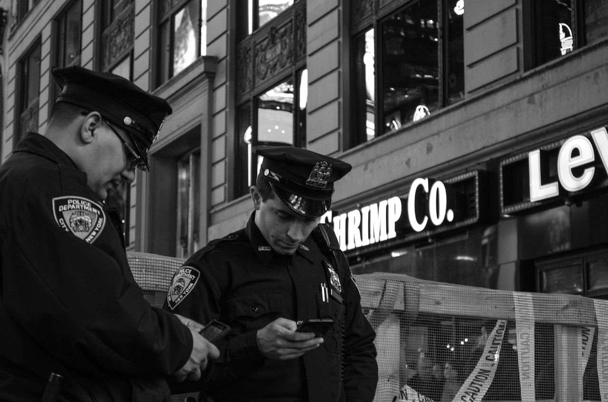

**I’VE GOT SOMETHING TO SAY ABOUT THAT, So Should You** – 

This doesn’t call for a *“Kumbaya My Lord*”* moment.

It’s not even one of those *“We Shall Overcome*”* moments peppered with chants, signs, arm-in-arm marches, and prayer. 

This doesn’t call for a peaceful knee-bowing demonstration either - I appreciate and respect Colin Kaepernick. 

I heard somebody tell a reporter, *“I don’t pay my money for a football game to take place and have to put up with players disrespecting our flag.*”* 

Everybody’s entitled to their opinion so here’s mine.

For the record, I believe in the power of prayer, but I must get something off my chest. If there is such a thing, it’s getting on some of their last nerve. 

Without saying it, some of them really want to ask the question, *“Why don’t you just go somewhere, ball up in a hard knot and die?*”* 

But I hear the late Maya Angelou say, *“And still I rise.*”* And I hear my soul shouting – YOU GO SOMEWHERE AND DIE, but that’s not right.

Disclaimer: I’m not a violent person, really, I promise I’m not. But this one here calls for one of those Malcom X moments: *“By any means necessary.*”* 

I’m referring to our black boys, men and women being *“mistakenly*”* shot and killed by police officers. 

This one just happened. Vice News reported hours ago that a black security guard was shot and killed at a bar he worked at by a responding police officer.

*“Midlothian officials (Chicago suburb) have release few details about the incident but confirmed that an armed security guard, 26-year-old Jemel Roberson, had been killed at Manny’s Blue Room Bar where at least four others had been shot. One of those four people is the suspected shooter. No other injuries are life-threatening…But Roberson, who is black, was apparently not the shooter. A witness said that Roberson had apprehended a possible shooter and police erroneously killed him.*”*
I’m sick and tired of them getting a slap on the wrist with desk duty as punishment or being put on administrative leave with pay until the investigation is complete. 

I’m livid when the follow-up press conferences confirm what I know I’ll hear, but wishfully hoping and praying that justice would be served. 
The cop gets off or he gets fired. In my opinion, that’s not enough. You took a life and it just happens to keep being the same group of people being targeted. 

However, when it comes to justice being served, more often than not, the bullseye is missed in court. 

And for my cowardly brothers and sisters afraid to speak out, you repulse me. Somebody’s got to speak up and take the hit for your scared self; you remind me of those who won’t cross the picket line during a strike – all talk, some no talk, but will benefit from the results. 

Perhaps you’d open your mouth if a situation knocked on your door and you were innocent or maybe not. Shame on you for idly standing by when our black boys, men and women are being harassed, shot and killed (mistakenly). 

A police officer threatened a homeless black man with a gun; he had a knife for protection and he wasn’t bothering anybody. 

He could’ve lost his life had it not been for a black woman who wouldn’t leave him and was recording the incident. Why is that necessary?

Can’t leave it there because some of them feel correct in their decision to take a life. 

Some of them are lying and are mad or maybe scared because they got caught thanks to cameras. 

Just a thought – what would happen if minorities were allowed to purge their community of cops who kept making those kind of mistakes for 24 hours with no repercussions? 

That’ll never happen but to those crocket, intimidated cops: You sir, ma’am have no business where blue. 

Some of you are making communities more dangerous than the so-called *“suspects*”* you’re trying to apprehend. 

That’s why Chicago is on edge right now because anybody with a little bit of sense knows that it doesn’t take 16 bullets to stop a suspect that’s running on foot. 

I’m sure the police officer who mangled the body of Laquan wouldn’t want to reap that – that was so horrifying I wouldn’t wish that on my worst enemy ever. 

Not all cops are bad but to the cops making *“mistakes*”* that result in the lives of our black boys, men and women being taken - you’re violent and you need Jesus. 

Acknowledge that you have an issue with your pathetic selves, get out of those blues and go get some therapy in your life. 

What are you so afraid of? Return when you’ve been released to do the job taxpayers are expecting you to do – or not. Maybe you’d be better off rotting in solitary confinement. 

I don’t know but this one thing I do know like I know my name – this mess has got to stop. 
