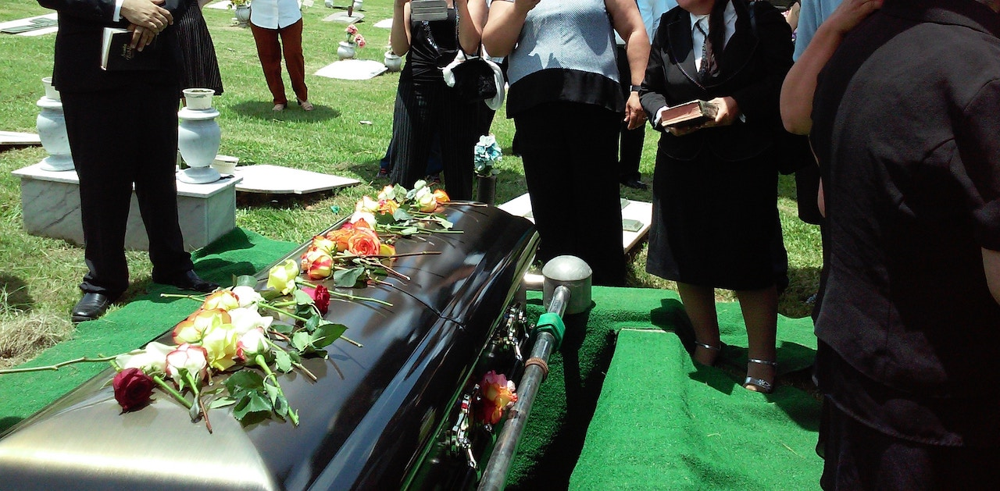

**BY THE NUMBERS**, *Politics and Entertainment* – One hit wonders - where did come from? Who are they? It’s as though they appear overnight and then fade away into darkness. 

Every now and then, an electoral candidate becomes a household name, but apparently that’s not enough in today’s election climate.

Perhaps the *“one hit”* curse won’t be the spell for former democratic candidates Stacy Abrams, Robert *“Beto”* O’Rourke and Andrew Gillum who recently lost elections. 

The best stories I was prepared to write about each of them would have highlighted their victories. 

Now their shocking defeats are buried beneath my fingertips as I try to make sense of the death of their campaigns. 

Abrams, a native of Madison, Wisconsin graduated from Spelman College in 1995. 

Abrams once burned the Georgia state flag in protest, years prior to running for State Governor.

The confederate flag hung since 1956, considered an anti-civil rights gesture.  

Abrams went on to earn her master of Public Affairs in 1998 from the University of Texas at Austin. She then went on to earn her law degree at Yale Law School.  

Early on after completing her studies Stacy worked as a tax attorney and then at age 29 was appointed the Deputy City Attorney for Atlanta.  

In 2007, Stacy Abrams was elected to the Georgia House of Representatives from the 84th district.  

She ran on a platform based socioeconomic fairness and youth issues.  

Her agenda championed concerns that plague the minority communities.  

Millions of Georgians feel disenfranchised and voiceless. 

Despite the campaign support of Oprah Winfrey, Abrams endured a long awaited loss.

In the final hour of Beto’s campaign, he secured the support of hip hop mogul Beyoncé. 

He was born in El Paso, Texas.  

Like Abrams, Beto also graduated in 1995, he earned his English Literature degree from Columbia University.  

Shortly after graduating college Beto was arrested for DWI.  
In 2001, his father was killed by a vehicle while riding his bicycle. Beto delivered the eulogy.  

In 2005, Beto entered politics.  

Beto won be a razor thin edge over the republican incumbent and became a Texas congressman. 

In 2014, Beto opposed President Obama’s executive power to protect 5 million undocumented immigrants.

*“The motive is noble, but the means are really hard to stomach,”* he said.

Beto has not always towed the line within the democratic party. 

President Obama took the stage for Gillum in Florida. 

Little did listeners know that his speech would be the final obituary for the Gillum campaign. 

Gillum born in 1979 in Miami, Florida.

Gillum shocked the country when he catapulted onto the national stage announcing his candidacy for Governor. 

He served four consecutive terms as Mayor of Tallahassee, Florida.

He is the first black candidate in Florida history to ever win the democratic nomination for Governor.  

The future of the 39-year-old is unknown – not every story has a happy ending.

Perhaps one day they will rise from the dust and ashes, but until then democratic party mourns their loses and their electrifying sensation will always be remembered. 
