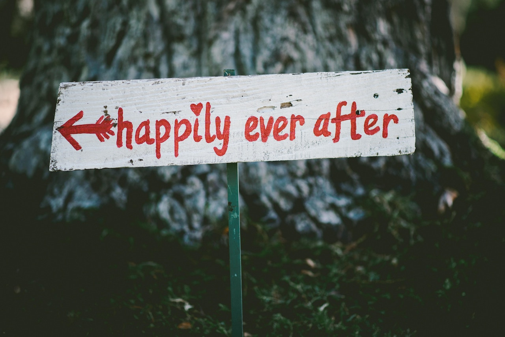

**SHE’S GOTTA HAVE IT**, *Think Like a Girl* – When thinking about today’s society of those who are getting married, it raises some valid questions.

Are the intentions and expected outcomes still the same as the traditional values of past? 

Some women married for financial security, others married their high school sweetheart out of obligation. So often, women feel like it’s naturally the *“the next step”*. 

Some women married merely to avoid loneliness. 

Unfortunately, single, expecting and want-to-be mothers marry to do things *“the right way”*. 

If you’ve noticed, I haven’t mentioned love yet. 

I used to believe that love should be the sole foundation of a marriage, but as I approach age 30 as a single, educated female, I realize that there are other factors.

As the old folks say, *“Love don’t pay the bills”*. 

Marriage is about more than walking down the aisle in a beautiful wedding dress – the life-long marriage is more important than the one-hour wedding.

I need a partner that’s able to contribute equally to a continued experience of love as well as financial responsibilities.  

In fact, marriage and motherhood is more appealing when a man can solely provide for the entire household, if need be.

Regardless, if women marry for love, money or just to have a man, the root of the decision seems to always stem from the need for stability and security. 

Women want to have the feeling of knowing that they’ll be taken care of financially – not that we can’t do it on our own.

Two incomes are always better than one.

Emotionally, the man will help us deal with our complex emotions, especially if he’s not abusive in any way.

I still wonder if marriage is necessary to make this happen? 

Statistic show that Millennials are in no rush to marry. 

Millennial women especially are not herding in masses to assume typical housewife and homemaker status.

Unlike decades ago, we seek multiple degrees, want to serve as community activists and become entrepreneurs. 

We start careers, travel the world, do what we want according to *“living our best life”*. 

If we can find a willing man to accompany us on our journey, all the better.

If not, then women are out here making moves independently. 

According to U.S. Census reports, about 41,500,000 women in the United States are married. However, 21,327,000 others are without men.

There are 11,822,000 women who have never married, 1,458,000 divorcees and 8,047,000 widows.

This means that more than one third of the 62,827,000 women in the United States are getting along without steady male companionship. 

How do they adjust to this fact of life? How do they like their man-less life? What are they doing to change it? Do they want to change it? 

It is a worldwide and historic conviction urging women to married.

Although a great many still have no desire.

Consciously or unconsciously, many of them spend a lifetime resisting it. Today, one out of every 10 families in the United States is headed by a woman. 

Why are so many women single? That’s a single question with a lot of answers. 

Countless women relocate from their hometowns for better career opportunities – like myself, we reel in a job, but remain the perfect catch for a man. 

It’s complicated. 

I can still remember a friend’s mother saying to me while I was at in high school, *“find a rich man dear, don’t marry for love.”*

That’s still not my idea of marriage. While it isn’t for me, in fact I can’t stand the idea of being committed to a person that I don’t like solely for money purposes, I do understand why it comes about. 

Perhaps the reason is based in not being able to find love, or lack of career focus and even financial desperation. Marrying for money is more likely to be the case if you’re getting hitched the second time around or later in life, past age 50. 

The truth is that despite this being 2018, money matters and some of us are still willing to say *“till death do us part,”* to get it. 

I want to be loved and to love – without neglecting the reality that bills must be paid. 

The truth is, some of us are still willing to say, *“till death do us part”*.

If I had to choose between a man, marriage, or money, I’d choose marriage – not merely an uncommitted man or a financially wealthy partner.  

Money and men are easily accessible, and Sasha enjoys a challenge; I’d rather take the challenge of falling in love.

Ladies choose wisely. 

Whichever choice you desire in life, just know that having a man means dealing with all that comes it – it could be his baby’s mamma, post-traumatic stress or his own mother. 

If you’re marrying just for money, you might suffer abuse, infidelity, or loneliness. 

If you marry simply for a marriage, you have to remember that marriage is not the finish line, it’s the start point.
