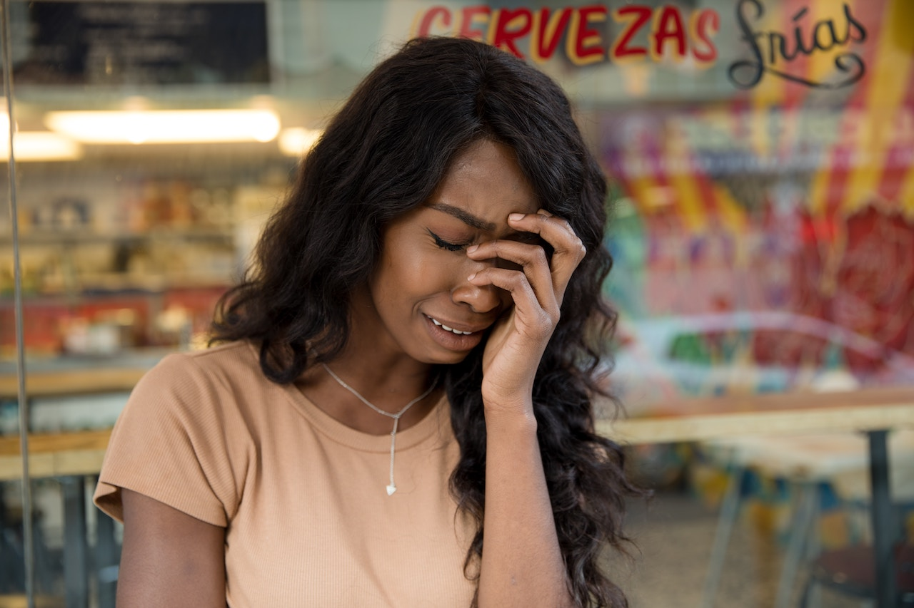

**I’VE GOT SOMETHING TO SAY ABOUT THAT, So Should You** – I wanted to say (in my Fred Sanford voice) – You big dummy!

But I couldn’t and I wouldn’t because she was too broken. I could hear it in her voice over the phone and when we met for a late lunch I could see that she had been crying – a lot.  

Her swollen brown eyes were bloodshot red and when the hostess asked us to follow her to our table she sat back down and let the tears flow in the waiting area. 

So I did what best friends do – I listened and at the end of her explanation – I didn’t know anything else to do but give her a hug.

Finally, we made it to our table in silence. 

After we placed our orders she found a way to open up even more. 

This time in between tears, she talked about her biggest regret in life – wasting time waiting on Mr. Wrong to turn into Mr. Right. 
I could hardly believe the words coming out of her mouth. 

With her permission, I’ll share with you that she had been in an on-again, off-again relationship with him for years. 

She had known him for more than 20 years and they dated most of that time. So much for wishful thinking right? Wrong!

The late Maya Angelou said, *“When people show you who they are, believe them the first time.”*
I am so sorry that she regrets the day she met him; I am equally sorry that she gave so much only to receive little to nothing in return. 

According to her, she gave her heart, body and finances to what she believed would turn into forever. 
Her question was, *“So how do I pick up the pieces and move on when I feel like he has a piece of my soul?”*

I was thinking to myself, *“Oh my goodness that’s deep and her heart is hurt to the core.”* 

I’m sure I had more to say but I can remember apologizing, saying *“I’m so sorry that he didn’t have the capacity to love you. 

Now you’ve got to cut him completely off this time.”* Without going into details of what she shared, I managed to fit in that it sounded like a soul tie. 

I never doubted that she secretly loved *“George.”* 

I say that because I sensed it was more than a physical relationship for her (you know your best friend); unfortunately, I couldn’t say the same for him. 

I hated seeing her so broken. I’m mad at him. I wanted her to leave him alone a long time ago but she wasn’t having it. 

Rather than loose our friendship, I silently wished he would break things off and he did. 

The problem was – it was habitual – he’d break things off and a year or so later, he’d contact her again. 
Why did she take him back every time? She said she loved him. 

Sometimes I think it was because he was convenient. If she wanted to satisfy her sexual needs – he was there.

If she was lonely, he was there. He always seems to show up when she needed to fulfil a need but I can’t explain why she loved him. 

What was there to love? What did she see in him? I don’t know. Some of our other friends even called him weird. 

This last time they *“tried”* to make it work, he just showed up at her job unannounced. One of her co-workers recognized him and sent her a text. 

She thought it was special. I thought it was strange. He never told her that he stopped by her place of employment; she had to ask him about it – tell me that’s not crazy. 

Anyway, now she’s beating herself up because she’s 50 and doesn’t have a husband or a child she has wanted for years. 

One of our friends said, *“He’s just playing with you. And you really can’t get mad because you allowed it to go on all this time.”* 

Then she had the unmitigated gall to say, *“He’s still not finished with you – you’re not finished with each other.”* She said, *“Yeah, we’re finished. It’s broke and he is too.”* 

Not that it’s funny but we bust out laughing because of how it came out. We told her, her momma told her, her daddy told her, and he showed her that he wasn’t that into her. 

You all know how best friends carry out. We concluded that he was the scum of the earth and that he wasn’t worth her shedding another tear. 

We also determined that he didn’t know what he had and that he missed out.  I hope she finds the man who has the capacity to love her and who is marriage minded. 

So the moral of the story is if you find yourself in such a relationship, find the strength to shake yourself loose. 

Run and don’t look back. Close the door, lock it, and throw away the key. 

Ladies, it doesn’t take a man 20 years to know whether or not he wants to marry you. 
It doesn’t take a woman 20 years to know that he doesn’t have the goods. 

Be encouraged; don’t stay down too long. Remember that you’re fearfully and wonderfully made. 

Get back out there and don’t lower your standards. One day you’ll meet Mr. Right and you’ll say the words *“I do.”* I’m pulling for you. 

Better yet, let’s pull for each other.

In my Bishop Thomas Dexter Jakes voices, *“Get ready, get ready, get ready!”*
