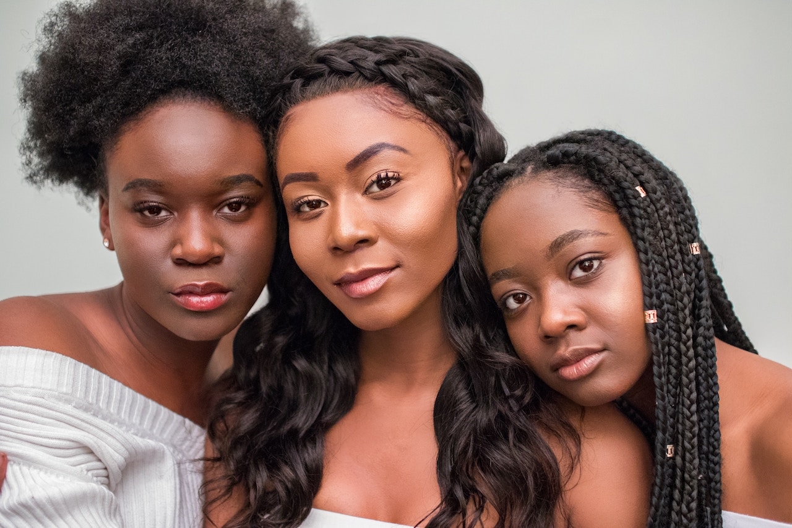

**SUPERMOM**, *Parenting Tips for Raising Black Kids* – I want my daughter’s first kiss to be with confidence – instead of some small-minded boy defining her beauty.

A healthy dose of self-confidence will empower her to avoid being tainted by temperamental teenagers or airbrushed with artificial aspects defining attractiveness. 

With no uncertainty, society prejudges black faces with prejudices and stereotypes. I’ve heard it said all too often, *“She’s pretty to be so dark.”*

What a disgrace.

There is nothing worse than psychologically pushing people into a prison of low self-esteem, shame and starving them of the self empowering sense of positive thinking. 

During an afternoon drive to a Girls Scout event, my daughter and I had a conversation about her dark skin.

She compared her complexion to everyone in our family.

*“I wish my skin looked liked yours,”* she said.

I reminded her that she has her own kind of beauty – with a touch of me within. She repeated, *“No, I wish I had your skin color.

No matter what I said, the compliments I gave or the assurance I provided, she remained convinced.

Somehow society slipped the thought into her head that darker skin wasn’t as beautiful. 
It hurt her.

As a result, it hurt me. Where did I fail?

I thought for sure I’d loved and complimented her more than enough – I didn’t think anyone could break her spirit. 

Someone or something somewhere had my beautiful, brilliant, priceless princess questioning the density of her black magic. 

As a mom, I want my daughter to be proud of her identity and love the skin that she’s in.  

I don’t say this simply because she’s my child.

Unquestionably, she’s beautiful.

I’m determined to inspire her to feel what others clearly see.

As Dr. Mom, I’m prescribing her one dose of confidence, an ounce of self-esteem and a small pocket mirror.

Confidence and self-esteem is crucial to their success. 

Absence of social approval, little black girls must accept their inner greatness and outward glow.

An important aspect of this acceptance is celebrating oneself.  The need for public praise is like a poisonous spell.

There are so many dark skinned sleeping beauties that have never been kissed by confidence.

So many black girls are sleeping beauties; dreaming of skin tones that haven’t been kissed by the sun.

Realizing that you are one of God’s greatest masterpieces will break the society’s spell. 

For the most part, my daughter is a strong and smart young lady. 

Unfortunately, young females often seek approval and acceptance – as adults, compliments continue to make women feel good.

As a result, I listen to my daughter’s concerns, ensuring that she maintains a healthy perspective of her own self-worth.

Meanwhile, prayers, praises, and promises are the ingredients to our daily prescription – because when self-confidence is conjured from unhealthy sources, it becomes as ugly as arrogance.
