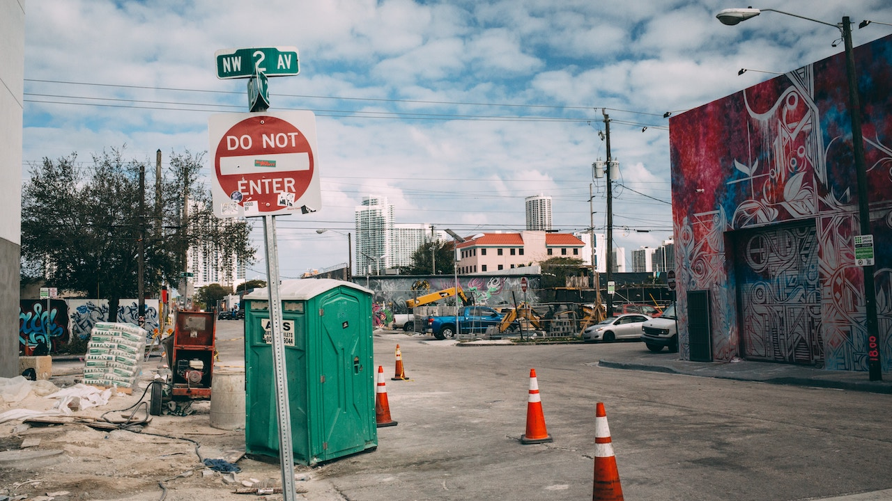

**URBAN LIFE**, *Our Culture and Community* – Is God in the ghetto?

Of America’s historically black protestants, 53% attend religious services. About 32% of people ages 30-49 attend services weekly, and only 17-percent of individuals ages 18-29 participate.  

One must first come to a conclusion about their belief in God, or lack thereof. 

Do you believe God to be a spirit that created life as we know it; Creator of the Heavens and Earth, omnipotent, the giver of life and death, Alpha and Omega, the beginning and the end?

Do you agree that God created the first man, Adam, out of mud and breathed life into his body, and then made Eve out of his rib?

This theology defines the same God that gave Moses the 10 commandments and granted him the power to part the Red Sea, allowing Hebrews to flee Pharaoh’s enslavement. 

He is the Creator of air, water and fire. An invisible existence that has the power to cause Sarah, Abraham’s wife, to get pregnant with Isaac at the age of 90. 

This is the the same God that is so powerful that he miraculously impregnated Mary as a virgin.

Do you believe in the God of the Bible, that told Abraham about the coming destruction of Sodom and Gomorrah, but was willing to change his mind if anyone righteous was found there? 

Some people believe he is all knowing and has a divine plan and knows things before they even happen.

As a result, I wrestle with this definition and reality of a powerful and all-knowing loving God who has the capability to perform miracles at will.

To agree with this theology and believe that these are facts, I would have to concur that God is some type of spirit that thinks, reasons, and likes or dislikes things on earth. 

That would mean he knows about homelessness, starvation, disease, murdering of the innocent, corrupt governments, and all the things humans do that destroy ourselves and our environment. 

To think this creator is observing and allowing calamities, without intervening, or even making himself and our purpose visibly known makes no sense. 

Considering the downward spiral of church attendance, apparently I’m not the only person wrestling with this theology.  

So, is God in the ghetto?

If this is who we are calling God, is my honest answer would have to be a resounding no.

However, I know there’s something greater than humanity. 

**SOMETHING GREATER THAN HUMANITY**

I see no evidence of an urban existence of pure love and all-power in my ghetto. If he does exist, I would have to assume that perhaps my people are not his people.  

Such a being could only be believed by someone who desperately needs him. 

I'm not saying all the information we've been taught about God is wrong or nonsense, but perhaps the very nature of God is taught to us wrong.  

For example, let’s consider how the nature of the human body is made up of a bunch of individual, independent moving parts. 

Your cells, bones, heart, skin and brain all do what they are designed to do by nature. 

Each one of these things function independently, but together they create a system called the human anatomy.  

One dysfunction, disease, or deformity can cause sickness in the entire body. 

Death occurs when we fail to maintain the circulation of energy that we call life. 

It’s similar to a solar system. 

From the largest solar system to the smallest of atoms and molecules everything works together effecting all things around it.

Nature is perfect in every way, and difficult to accurately or precisely duplicate.  Nobody can create nature, nature just is.

Human beings by nature are logical creatures, asking questions and seeking answers. 

As a result, we know atoms exist – and an atom is 100% natural – we can study and learn from them. 

Are we to believe that God is illogical? Are we unable to even grasp a glimpse of God’s existence to understand the significance of existence, whether God’s or ours? 

To draw conclusions about God based on what others have told us empowers mortal men with a monopoly  through manipulate and control our entire belief system.

Plants, planets, animals and human beings all have systems that we are able to understand, at least in some basic form.  

Everything in our world is a combination of other things found in nature. Likewise, we are a unit within our environment, capable of gaining a sophisticated understanding of our human existence. 

Our beliefs in something greater should be based in this reality.

Using a parallel between nature and spirituality doesn’t define individuals as carnal, it causes us to become more knowledgeable of greater realities.

**SEEING GOD DIFFERENTLY**

For instance, the Bible says, “In the beginning the Word was God”.  

Well words are sound, and sound is vibration, and vibration is energy – vibrations create.

All existence vibrates on some level of frequency; this is God – the only God we know. 

So then, the expression, “The children of God,” is true, we are the off spring of energy.

God is indeed everywhere at the same time, omnipotent and omniscient.  God is everything – energy is everything – energy is neither lost nor destroyed, merely transferred from one object to another. 

Energy is a complex and convoluted system that humanity needs to better understand, yet we will never completely comprehend energy – it is an unending, but worthwhile search.  

With this indisputable understanding, I’m confident God is in the ghetto.

God is everywhere and in everything – we’ve never been taught to recognize the power of God. 

While we can’t visible see energy, we see, hear, feel, taste and touch its impact, regardless of what religious language used to describe it. 

Instead of listening to the aged-old traditions of men, try listening to the nature of God. 

Countries, communities and individuals who don’t believe in the nature of God, or defy it, usually become distinct or self-destruct. 

Perhaps that’s what’s happening in the ghetto, people are defying God, playing God, and trying to redefine God. 

As a result, people are self-destructing in dilapidated neighborhoods with churches on every corner. 
  
Who is God? That’s the rhetorical question every believer and non-believer alike needs to ask themselves. 
 
Afterward, the answer will glare in your face with blinding brightness, “Yes,” of course God is in the ghetto.
