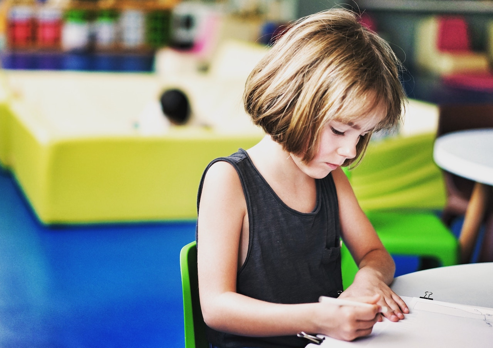

**LIVING ROOM TO CLASSROOM**, *Teachable Moments* – As I have progressed in my career as an educator, I have often reflected on my own life experiences.

I’m reminded of going in and out of different schools as a child and adolescent, as well as my professional experiences – I’m excited to share.

I also often think back to my short stint in early childhood education where I worked in a pre-school setting. 

Early childhood is and should be a magical, meaningful, and purposeful place for children. 

From the moment a child is born, the foundation of who that baby will become is being formed and designed by the choices, opportunities, and exposures the parents provide. 

When I became the parent of a newborn, I remember feeling paralyzed at moments due to the pressure to provide my child the richest experience and environment that I could from infancy. 

I knew it was the foundation that all other skills would build upon from language to attachment to health and safety. Every choice mattered so deeply to me.

Parents are their child’s first teachers.

Parenting an infant felt like the highest stakes test I had ever taken. Coffee took on a more functional meaning.

Narrating diaper changes to my baby through exhausted, blurry vision became my new norm. 

If I was too exhausted to narrate life for a moment, I had to muster up the grace for myself and try again in the next cycle of *“eat, activity, sleep.”*

As an educator, I saw how the exposure to rich and meaningful early childhood experiences played a critical role in a teenager’s love for learning and connections between disciplines within my classroom. 

Because of this, as a parent I have embraced messy *“art”* projects to increase creativity and discovery, filled more buckets with beans for pouring to foster fine motor skill development. I’ve observed my daughter as she sorts her toys, classifies her many Elsa figures, and creates a world I could never imagine due to the realism in my own head. 

In social settings, I have watched her work with others and innovate, problem-solve with her peers, advocate for herself, nurture and care for those who are younger or need more help, as well as meltdown or not respond the way I would want her to as a friend. 

I have learned that most of the time when conflict arises between children, they will solve the problem themselves when given the opportunity to do so. 

They can be coached to go to their peer to determine a solution or apologize for their actions. Sometimes I have to model what that looks like, but it is possible. 

Early childhood is that place that builds self-confidence, independence, and the foundation for a host of social, emotional and life skills, not just academic skills. 

It is the place that prepares children to become the adults we hope to see in our communities that we admire and pray are our neighbors and co-workers. 

Embrace the moon sand spilled onto the ground, the paint in the hair, and the stepping on Legos!
