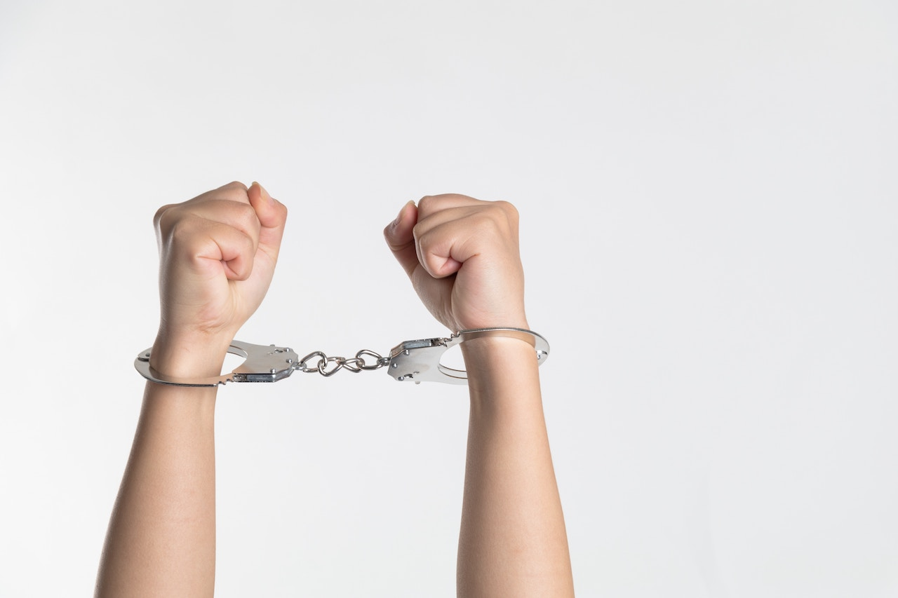

**FORGIVENESS**, *Healing the Soul* – I’m here to help others. I became a certified life coach in order to assist people pursuing their passions.

I help people craft the life they are created to occupy. 

As a result, I dedicate many days pushing people to maximize their potential. 

Many people ask, *“What’s the difference between counseling and life coaching”*.

Ultimately, counseling offers formal methods to help people work through their past traumas. On the other hand, life coaching recognizes the same issues, but informally empowers individuals to focus on moving forward.

As a life coach, I help people avoid getting stuck in the past. 

People must let go of the past and forgive, if they expect to soar, sometimes that also means forgiving oneself. 

Forgiveness is oftentimes the greatest roadblock people face that prevents them from moving into their destiny. 

I am passionate about writing about forgiveness. I believe it is my calling to help release and relieve people from the *“burden of unforgiveness”*. 

I desire to inspire.

My greatest inspiration is motivating people to leave the past in the past and move forward.

This is how we create an ideal life and pursue our passions. Unforgiveness is by far the most damaging emotions decision that eats away at our peace. 

It sears at human consciousness and shackles people in prisons the past. 

When we don’t forgive others and ourselves, we suffer – not the other person. 

Unforgiveness creates relationship problems, health issues and emotional upheaval in our lives.

Let’s go on a journey to discover the consequences of unforgiveness. Allow me to guide you to a place in life where your soul can be liberated. 

I will offer tools you can use to help get yourself out of this *“prison”*. Lastly, learn how to move forward when you feel as though you can’t let it go.

I took professional training to become a life coach.  I also studied on the subject and how to best help others set goals, move forward and define the life they’re designed to live. 

This blog series on forgiveness will offer helpful suggestions and tools to get yourself out of the *“prison of unforgiveness”*.

Follow my blog each month, click below to send feedback, and you will soon discover yourself living a life free from guilt, condemnation, and judgement. 
