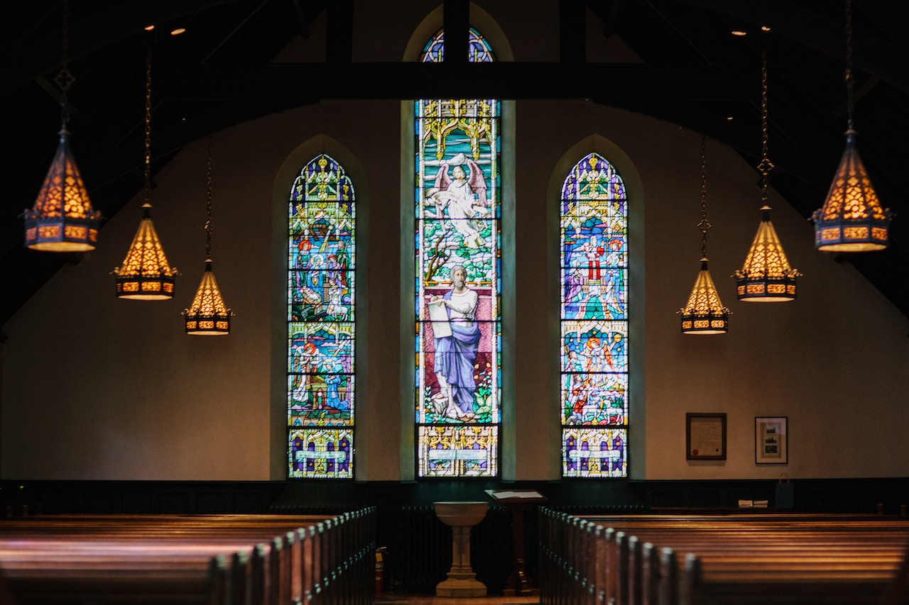

**GLOVES OFF**, *Religion, Race, & Reasoning* – Who is God and how can we know Him? Welcome back!

This week we focus on God and not some abstract ghostly figure so often painted upon the canvas of our minds by mystics who can only relate to a mystical kind of god.  

There is good news.  God is real and we can know Him.  Let’s explore!

**Who is God?**
 
God is the Spirit.  

God is not a cloudy figure in the sky with pristine feet protruding from beneath a glorious white robe.  

He is the Spirit. Why call Him, He?  Simple.  God has revealed Himself to mankind, His own creation, as a Father.  

In this way, God shows mankind what fatherhood is to be and how to properly care and instruct children as well as one another.  

Additionally, by revealing Himself as a Father, God set an appropriate order for creation so that His blessings can flow uninhibited and mankind can live in peace.

**Can We Know Him?**
 
The answer is simple - yes!  

God our Father has revealed Himself to mankind in two ways: general revelation and special revelation.  

**General Revelation**
 
General revelation refers to all the things that ignite our senses: feel, taste, smell, touch and see.  

In other words, God’s creation, the earth and all that is in it, resounds of His existence and allows us to known Him; albeit, rather elementary - yet we can know Him. How so?  

It is no mystery that the earth maintains consistent cycles and has done so since God created it.  

For instance, the seasons and the accompanying activities happen consistently without deviation.  

Springtime brings blooming and budding as well as mating among the animal kingdom. Summertime brings harvest, heat, and long sunny days.  

The fall brings cooler temperatures, the changing of leaves from green to a variety of colors and the final harvests.  

Wintertime brings cold temperatures, snow in some places and rain to others.  Activity is more limited and the days shorter.  

The consistency of the seasons, which mankind has no control over or means to significantly influence, happen regardless.  Only God, the Father, could have done such a thing.

**Special Revelation**
 
Special revelation refers to God communicating to His creation – His divine will.  

This communication is audible and is written because it is relative to mankind and endures forever.  

The best and only known reliable source of God’s special revelation to mankind is His Word, called the Holy Bible.

The Holy Bible contains special revelation to them who seek Him and desire to know Him beyond what nature reveals.  

Comprehension of His special revelation comes to those who sincerely desire to know the Father, who responds by revealing Himself more intimately. 

To understand God’s special revelation, one must be His child and as such the Father will instruct His children, accordingly.    

Next week, we will explore the nature of God as communicated through His Word, His special revelation.
