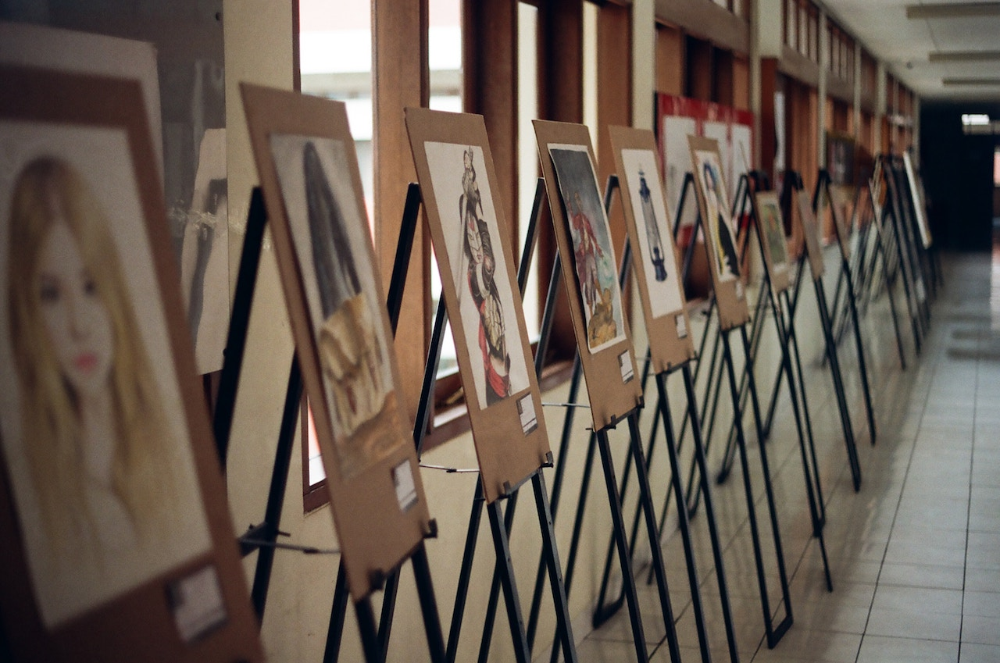

**ART FOR EDUCATION**, *The Glory of Expression* – If art is for everyone, why do we have art critics? 

Imagine a world that allows a seamless expression of oneself, through the arts, without a critical comment or a negative attitude. 

This is the world I have been striving to live in myself as an artist. This is the world I envision for my students to whom I have the pleasure of teaching art. 

Guiding students to use any kind of art to express themselves gives them many skills throughout their lives.  

Art as communication should never be extinguished as a vital form of expression. 

There are art critics who are responsible for the flow and the sale of the art kingdom. There are also passive critics who makes assumptions of what “creatives” are making. 

These passive critics are our friends, neighbors or even strangers. 

If we allow “freedom of expression” but allow everyone’s opinion to muddy the waters, we would not have any “freedom to express ourselves” in our own unique way.  

The personal expression of art would just be a watered down version that pleased the masses. 

Imagine a world where a child could create art in any way they desired. 

Not every mark has to be celebrated or every stick figure revered like the Mona Lisa. However, the journey to self expression could be celebrated and encouraged to allow for growth and opportunities. 

Making mistakes and learning how to communicate through art allows us all the freedom of individuality. 

Making mistakes without the concern of criticism, allows one to learn to creatively solve problems.  

It allows the freedom to be independent thinkers and have original ideas.  

Art is about communication, story telling and expression. 

Allow the mistakes, the curiosities and the journey without relying on the opinions and assumptions of others. 

Walt Whitman once said, ‘simplicity is the glory of expression,’ which is a beautiful way to say that everyone has a intrinsic need to express themselves. 

The simplest form of any kind of art expression is important for us as we forge relationships with one another.  

The next time you see someone using art as communication, listen to the story and celebrate their individuality. 

Encourage young artist to make mistakes, to view ideas from other people, to work with others.  

All of these things will build an inner story within themselves and will help build their creative expression. 
