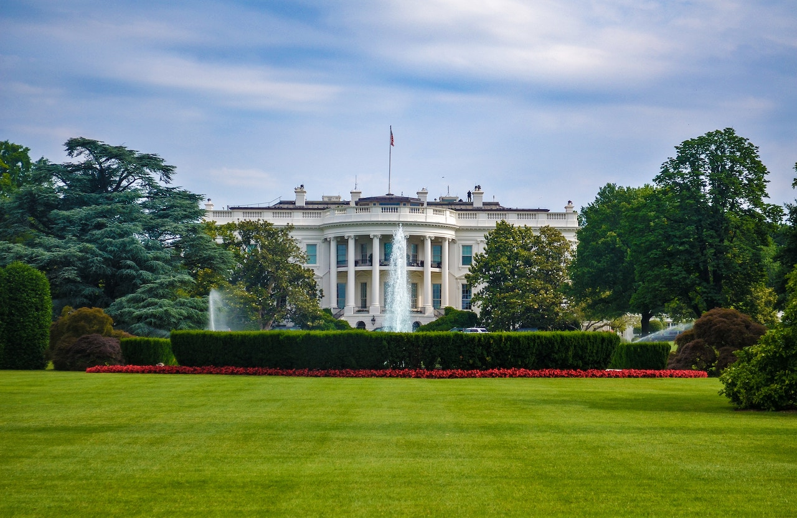

**BY THE NUMBERS**, *Politics and Entertainment* – CNN wins the battle against Trump’s White House administration.

But what next?

Federal judge Timothy Kelly, who was appointed by President Donald Trump, ruled in favor of reinstating Jim Acosta’s press pass to the White House.

However, the language scripted into the verdict empowered the President with ammunition to charge back to the frontlines of the war on the media. 

President Trump’s twitter rants have proven that he is no pushover – the country is on pens and needles awaiting his next move.

The first round down range ricocheted when White House officials revoked CNN political report’s press pass.

Unquestionably, President Trump positioned himself in opposing trenches against mainstream media during the 2016 election season.

He called the media *“the enemy of the people.”*

According to media reports, President Trump ignores questions, echoes rude responses and blatantly belts out nasty remarks. 

*“What a stupid question that is,”* he replied to CNN reporter Abby Phillips. *“But I watch you a lot, you ask a lot of stupid questions.”*

[Link to CNN article]('https://www.cnn.com/videos/politics/2018/11/09/trump-press-gaggle-abby-phillip-stupid-question-response-vpx.cnn')

President Trump’s war is not only against CNN’s black female reporters like April Ryan and Abby Phillips, he seems to want the entire network crumble to its knees.

Recently, the White House released a bomb shell taking the unprecedented step of suspending Acosta’s press pass.  

The retaliation occurred after a combative exchange between Acosta vs. President Trump.

*“Are you worried about indictments coming down in this investigation?”* Acosta asked.

Afterward, the White House press aide attempted to recover the microphone from Acosta, who visibly and physically pulled away refusing to release the handheld mic.

*“I’ll tell you what. CNN should be ashamed of itself having you working for them,”* said President Trump. *“You are a rude, terrible person. You shouldn’t be working for CNN.”*

Afterward, Acosta was escorted out of *“the people’s house”* and off the premises. 

White House press secretary Sarah Sanders, cited Acosta’s brief confrontation with a White House press aide as the reason for suspending his press pass until further notice.  

For days, CNN attempted to come to a resolution.  

Afterward, the network filed a lawsuit against the White House for infringing on Jim Acosta’s first amendment right.  

Judge Kelly cited the White House actions as unconstitutional, and ordered the White House to immediately reinstate Acosta’s press pass.  

Included in the Judge’s dissent are directions for the White House to create and follow due process procedures for future cases.

The press can expect new White House protocols soon.

After drafting new White House rules of conduct for press conferences, Acosta will need a new rule of engagement.

Otherwise, Judge Kelly has already defined the judicial narrative for final verdict.

This war is not over.
