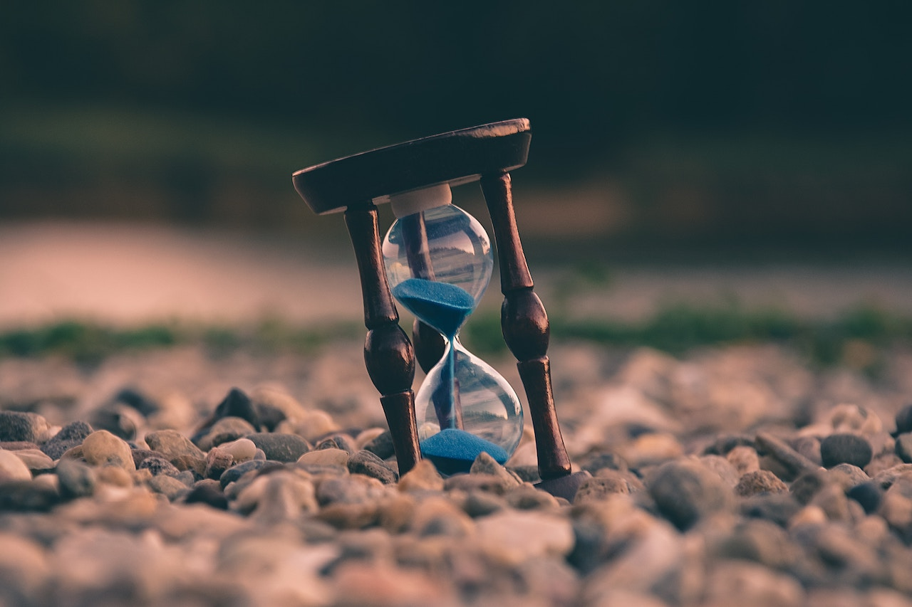

**THE THINK TANK**, *Elevating Consciousness* – It’s odd writing about my own end-of-life circumstances in a blog article. 

I am dying. 

I realize death is difficult for most people to deal with, but many of you would have found out sooner or later. 

It’s a complicated story, but I’ll write it as creatively conceivable. Reminiscing about life’s most magical moments makes me smile – I’ve lived a great life – don’t cry for me.

At a young age, a Bronze star defined my reputation as an American combat hero fighting on the frontlines of war in Iraq. I gained acceptance into one of the countries finest catholic schools for journalism and traveled to every continent on the planet, with the exception of Antarctica. 

Upon marrying the woman I love, I parented the son I always wanted and raised the daughter of my dreams. I’ve penned 7 books, published the works of more than 40 authors, released 2 websites and continue to circulate literature globally. 
[(Available on Amazon)]('https://www.amazon.com/s/ref=nb_sb_noss?url=search-alias%3Daps&field-keywords=Anthony+KaDarrell+Thigpen')  

I’ve photographed the most captivating aspects of God’s creation and wrote international and feature articles for one of the nations leading newspapers. …I could go on.

The point is, I am happy to have lived a healthy and fulfilling life. 

December 11, 1993, one of closet friends, who was 20-years-old at the time, experienced a lengthy wait prior to a complicated heart transplant at Brooke Army Medical Center in San Antonio, Texas.

He was diagnosed with an enlarged heart. Recent tests revealed premature ventricular contractions which ultimately concluded in a pending need for another heart procedure. 

Again, I plan to be right by his side.

Despite the 5-year limited life expectancy of heart transplant patients, he has survived 25 years and counting. To put things in perspective, the longest living transplant patient died 33 years following the procedure. 

My friend became a body builder, travels the world, and lives life to the fullest – he is not crippled by the certainty of death we all must face. Instead, he grabs life by the horns and steers it in the direction he desires to go.

His entire existence exudes the reality that he is not waiting to die, but rather living his best life. His upcoming procedure is expected to go smoothly, because he’s health conscious. 

He eats to live.

During a recent Thanksgiving dinner, I was encouraged to serve myself during the buffet-style feast prepared for a caravan of omnivores. 

The tempting aroma saturating the room. I gazed in awe at the beautifully displayed dinner; turkey, dressing, mac & cheese, candied yams, and so much more.

I smiled and whispered to an inquiring guest, *“I am vegan.”* 

Immediately afterward, another guest ambushed me near the sidelines of the kitchen sink with a story about a woman who’d lost her two children in a car accident. 

I admit, the ordinarily kind woman usually narrates inspiring stories – the intro left me speechless – the conclusion discombobulated me.

She concluded by explaining how woman said she would do one thing differently, *“I’d let them eat ice cream and treats.”* 

Her words were not exactly a typical Thanksgiving testimony.  

She winked. While walking away with a plate filled with turkey and all the trimming, she said, *“Something to think about, huh”* as we both looked over at my daughter.

Well, I thought about it. 

Without echoing negativity about others, let’s just say, my family maintains a healthy vegan diet. We eat to live, not with an unhealthy or pessimistic view that *“we’re all going to die anyway”*.

Yes, we are all going to die one day, although my mantra remains, *“Accept No Defeat”*. That applies to every entity of my existence, my lifestyle, ambitions and diet.

Even if the *“fat lady starts singing,”* so to speak, it’s not over until it’s over. 

Live your best life, don’t compromise your health, self-worth or any other important decision just because mortality assures us that we will die. 

Go places – prepare to take flight.

Raise your table tray, adjust your seat in the forward position, turn off your electronic devices, secure your seatbelt and get ready for take off.  

It’s never too late to chase your dreams, think bigger and aim higher. 

Hopefully you didn’t read this article anticipating my expected end – there’s no impending burial, none that I’m aware of. How are you doing? (Click feedback). 

I’m vaguely reminded of the 2007 Hollywood blockbuster featuring Morgan Freeman and Jackson Nicholson, The Bucket List – Live life to the fullest. 

I plan to keep embracing every sunrise as my new beginning – my bucket list is bottomless.
