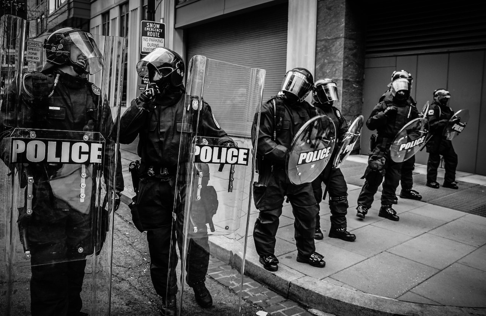

**BLACK-On-BLACK**, *Law and Order 100* – As a black officer, I work in a predominantly black city and I’m often asked the question, *"Do you feel like a sellout."*

The answer is a resounding, *“No!”* 

Policing is a profession and I love what I do. 

It’s unfortunate that police are perceived as the enemy within urban communities based on bad decisions of a few disappointing officers.

When a doctor misdiagnoses patients or provides improper treatment, resulting in death, do the black citizens stop trusting and relying on medical practices?

When teachers take advantage of undeveloped school-aged children, manipulating their minds, and coercing sexual encounters, do we home school our children?

The answer remains a resounding, *“No!”* 

The masses continue maneuvering to the doctor and directing our children to campus. 

So, why do the same people mold their children to either fear the police or say *"F the police"*.

I’ve seen parents treat their own children worse than officers. 

I often watch mothers drag their kids toward me, with faces filled with anxiety and tears streaming – it’s like their living a nightmare.

Most people usual come to peace with facing the consequences of their criminal offenses after breaking the law.

I have never been referred to as an unjust officer. 

I give respect even if it has not been earned, because I do recognize that as a policeman I'm held to a higher standard. 

I have never tarnished my oath as an officer.

I am not unjust to any race or ethnic group of people.

I never conducted myself in any manner that would warrant me being labeled as a traitor or sellout.

Think about this.

Before you label a black officer a sell out, traitor or uncle Tom, take a step back and look at your community and your household. 

How many black men could actually do more for their kids, financially, emotionally, or physically? 

How many mothers could be a lot more nourishing towards their children?

What bad examples have you displayed in front of a developing young mind?

What knowledge didn’t you pass on that could have saved someone from the streets or ever encountering a police? 

These are the realities in the black community. 

These are the true traitors – people who forsake their own children and overlook their own community are the sellouts we should be concerned about, not the police. 
