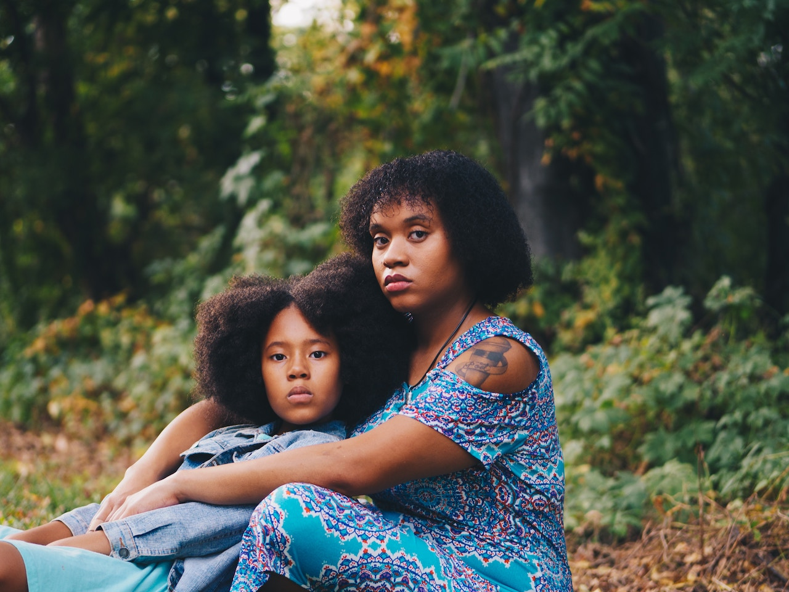

**SUPERMOM**, *Parenting Tips for Raising Black Kids* – I’ve actually never thought about writing a blog, even though I have some sensational stories to share. However, I have thought about writing a children’s book.

The idea runs across my mind to create a comical narrative about a black family like mine. Ultimately, I want my kids to read a realistic narrative about a family they can relate to.

Books empower kids to think critically and reflect about their own lives. Currently, my life is hectically awesome. 

As a result, carving out a capsule of time to sip on a cup of coffee and write a book about our family experiences isn’t in my foreseeable future.  

A book is near the bottom of my bucket list of things-to-do. Right now, I’m far too busy being a supermom – and proud of it.

My editor titled this blog, “SUPERMOM, Parenting Tips for Raising Black Kids”. I actually think I’m an ordinary mother. Then again, everyone has strengths and weakness. It just so happens that one of my strengths is parenting. 

I hope to offer some heroic help as my contribution to other parents across the country.

Parenting is not always easy – even though my husband helps.

I work a full-time job. I care for the physical, emotional, educational, and other needs of my children.

My duties include buying, ironing, and washing clothes, grocery shopping, preparing breakfast, providing lunch and cooking dinner.

Afterward, I help with homework, attend parent/teacher conferences, and volunteer at the school. 
It doesn’t stop there.  I’m the taxi driver for school, Girl’s Scouts, and after school activities.  In fact, I’m the Girl’s Scout troop leader. 

I’m the party planner for birthdays and holidays. I’m the therapist that ensures the psychological wellbeing of my children – I make them feel special. I’m the doctor providing tender loving care when they get sick or heartbroken.

The list of things-to-do as a parents seems endless. As they age, I support them through puberty and hormonal changes. While all of this is going on, I still have to tend to haircuts and natural hair styling. 
   
Did I mention social media, sports, peer pressure, spirituality, traveling, driver’s license, chores, decorating, slumber parties, allowances, and so much more. The list goes on-and-on.

The truth is, being a parent never stops, and being a working mom leaves little time for personal hobbies and pampering habits.

Somehow, you must manage to carve out moments to take care of self and your sanity.
 
I think what makes my experience magical is the fact that I love being a mom, and I love my kids. They all make me smile, but as a woman, it’s something uniquely special about mothering my daughter. 

Her birth stirred a sense of adrenalin and excitement, but I was also nervous – all at the same time.  
During my pregnancy, I dreamed about her many nights. What would she look like? What would I name her? How would I raise her? What would her hair be like? Would she genetically acquire dominant genes from my side of the family or my husband’s? At birth, she was a perfect combination of us both. She is healthy. She smiled a lot and she brought us great joy. 

Her introduction to the world reminded us that we are blessed. 

There where days when I nailed it as a mom, and other days when I felt like a total failure. One indescribable characteristic about children is that it’s like their programmed to forgive and allow parents to experience repeated chances. 

So, don’t throw in the towel if you’ve failed, because they won’t give up on you – no matter how disappointed they are. 

This blog is scripted to celebrate mothers working toward supermom status – you’ve already suffered through the miracle of childbirth; we’ll get through the rest together.

Everyday is a worthwhile struggle.

Raising our chocolate covered daughters, trying to comb their kinky hair, and listening to their complicated thoughts can be difficult. Teaching them to love their chocolate covered skin, respect their black history, and take ownership of their self-worth requires sisterhood. 

My blog is written like a conversation between friends – I’ll share my secrets, successes, and parenting flops and failures. 

My makeup is my mask, my make-believe apron is my cape, and this journey of blogging enables me to virtually show up supporting women worldwide. 

They call me the blogging Supermom, because all mothers have a heroic story worth taking time to share.

